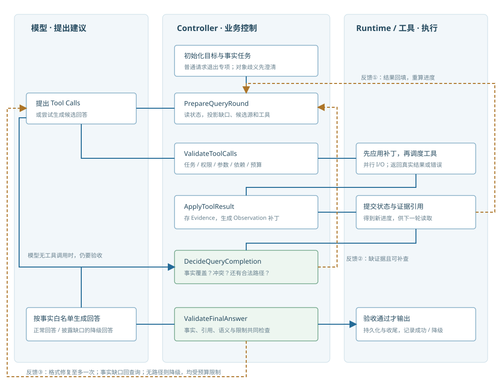
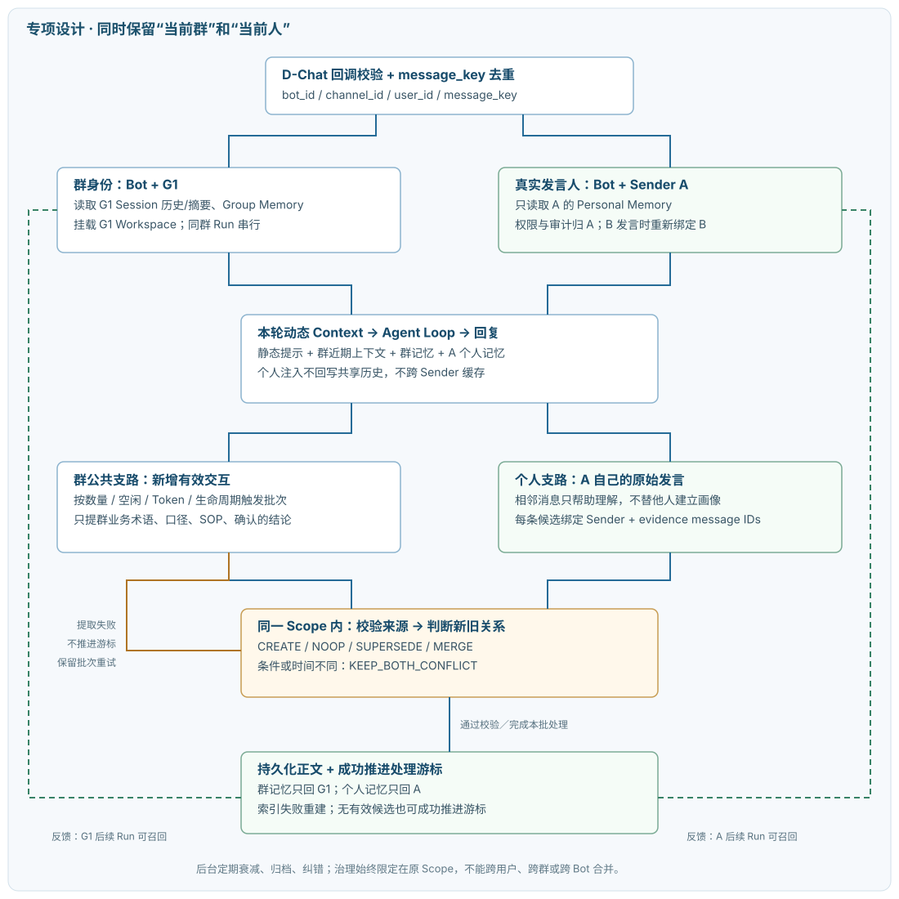
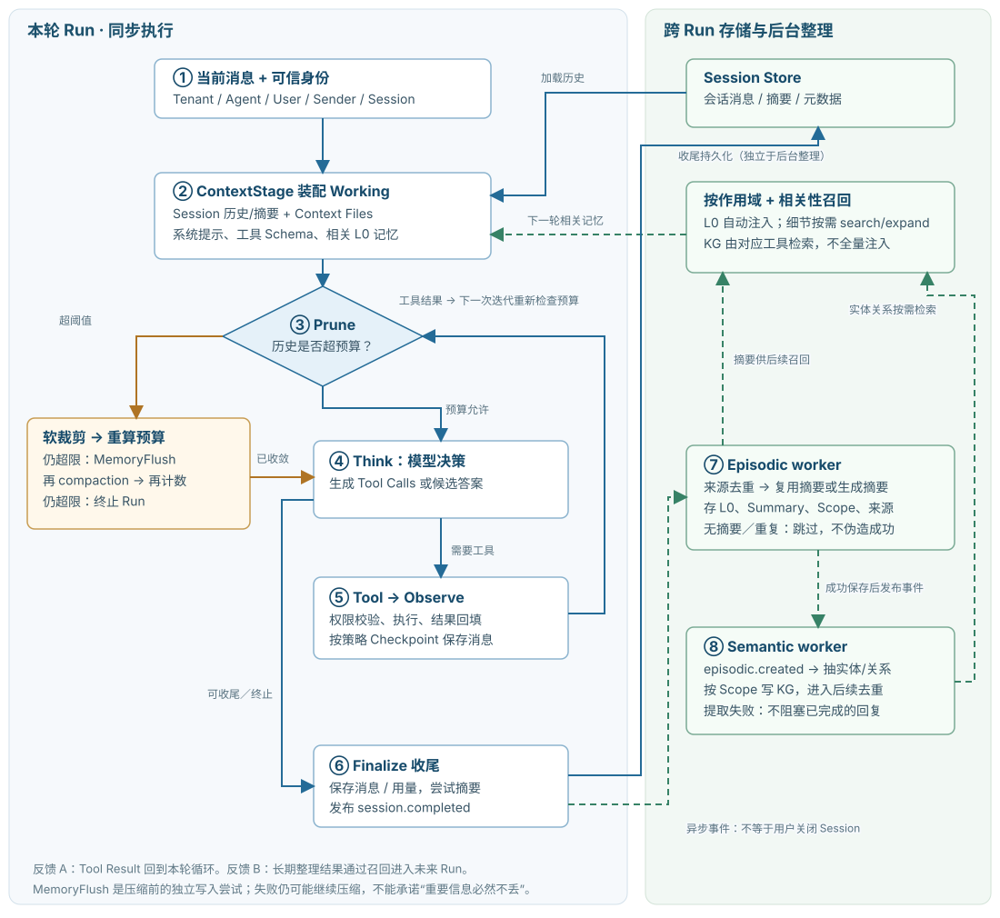
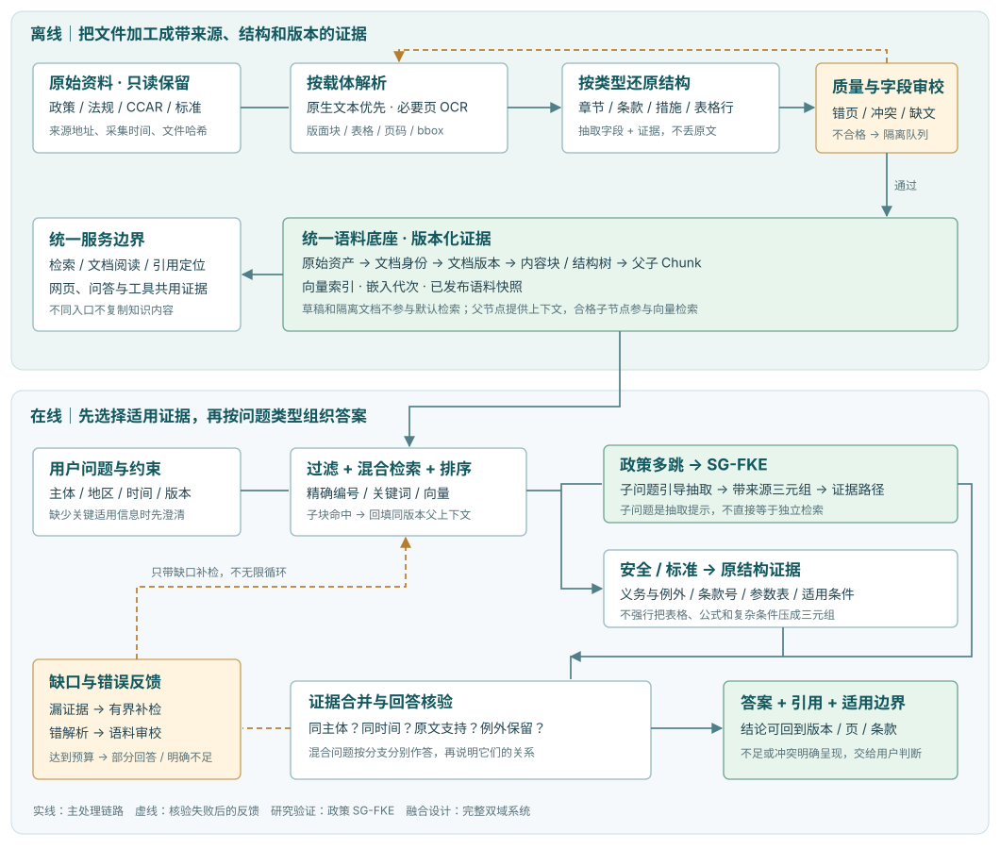
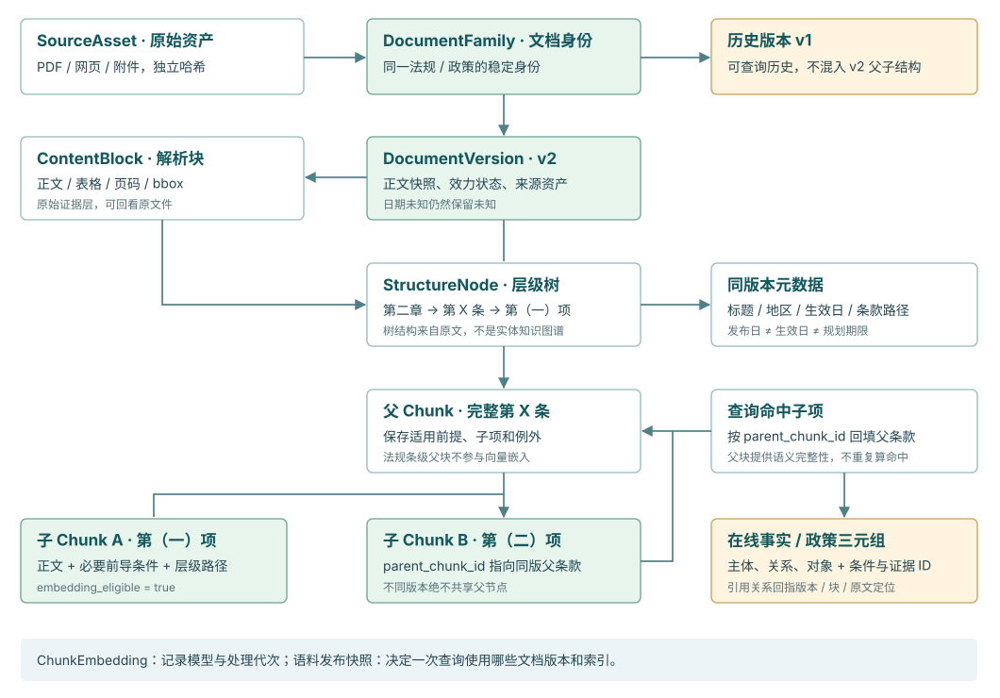
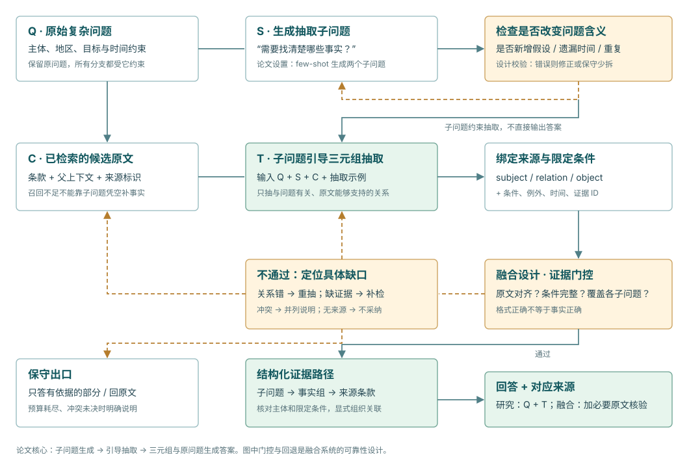

# 业务面与 AI Coding SOP / 工具实践

来源：私人面试网站的业务面完整内容，以及主管面“对外输出：AI Coding SOP 与工具实践”模块。以下内容按网页原文导出，未压缩项目细节。

图表文件保存在同级 assets 目录；移动本文时请一并保留该目录。

## 目录

- [业务面通用主线与现场路由](#business-stages)
- [第一项目：Voyager 业务信息查询 Agent](#first)
- [第二项目：Robotaxi 碰撞检测 VLM 评测](#second)
- [学校项目：低空经济多源异构文本智能问答与知识抽取系统](#school)
- [对外输出：AI Coding SOP 与工具实践](#coding-sop)

## 业务面页面说明

业务面按固定主线持续沉淀每次业务面的新增问题、回答和复盘，不再按公司拆分。

- **自我介绍：** 背景与岗位价值
- **项目拷打：** 机制、证据与取舍
- **八股／基础题：** 技术深度与边界
- **反问：** 团队、岗位与反馈

## 一、业务面通用主线与现场路由

### 业务面通用主线 · 持续累积

**01 · 自我介绍**

把背景、主项目、技术方向和岗位价值连成一条主线，主动把面试引向准备最充分的内容。

**02 · 项目拷打**

证明项目真实做过：讲清业务问题、个人边界、技术机制、验证证据、方案取舍与不足。

**03 · 技术追问**

围绕简历技术栈继续下钻，包括八股、Agent、RAG、工程基础、算法题及安全可靠性；完整题库见左侧“八股题库”。

**04 · 反问**

确认团队真实业务、岗位成功标准和成长空间，同时展示对业务与技术的长期判断。

#### 现场路由：问题 → 项目 → 展开层级

先判断面试官正在问哪一类问题，再决定讲到哪一层；不要一开始把完整知识库全部讲完。

30 秒 → 90 秒 → 白板 → 深挖

| 面试官的问题信号 | 优先切入项目 | 30 秒 | 90 秒 | 白板 / 图示 | 继续深挖时进入 |
|----|----|----|----|----|----|
| “介绍一个你做过的 Agent / AI 应用项目” | [第一项目：Voyager](#first) | [1.1](#first) 先讲业务背景、个人主线和有状态查询 | [1.2](#first) 补充 Goal、Task、证据和 Controller | [1.3](#first) 从问题到可核验答案的状态循环 | [01—10 完整深挖](#topic-origin)：控制、路由、工具治理、记忆、恢复和评测 |
| “讲一个评测 / 视觉模型 / Bad Case 项目” | [第二项目：Robotaxi VLM 评测](#second) | [3.1](#second) 先讲低频高风险、Recall 和 Bad Case | [3.2](#second) 补充三方评测、盲审和结果 | [3.3—3.7](#second) 混淆矩阵、指标函数和 F2 取舍 | [3.8—3.15](#second) 证据链、实验生命周期、归因和追问 |
| “讲一个 RAG / 知识抽取 / 学校项目” | [学校项目](#school) | [60 秒主线](#school)：异构文档、证据和 SG-FKE | [90 秒展开](#school)：类型化抽取、三元组和问答链路 | [项目图示](#school)：文档治理 → 检索 → 子问题 → 证据回答 | [完整章节](#school)：SG-FKE、实验、检索、PostgreSQL / pgvector 选型 |
| “为什么这么设计 / 这个技术怎么实现” | [当前被问到的项目](#first) | 先直接回答当前问题的结论 | 补一个机制、边界或取舍 | 只画能帮助理解的局部图，不主动重讲全项目 | [进入对应深挖章节](#topic-origin)，按追问定位到相关小节 |

**现场节奏：** 先给结论和个人职责，再给一条机制链；面试官点头就停，继续追问再展开。第一项目上方的“现场速答区”和下方的“完整深挖知识库”都是完整正文，前者是现场入口，后者是准备与追问索引。

#### 01 · 自我介绍：统一开场话术

面试官您好，我叫赵一恒，目前在厦门大学电子信息专业读硕士，将于明年毕业。我的实习和在校项目主要聚焦在 RAG、AI Agent 和 AI 应用落地。在滴滴实习时，我参与了团队内部业务信息查询 Agent 的方案和研发，负责信息查询链路和记忆系统的设计与开发，重点解决复杂查询中工具调用不稳定、多轮执行丢进度，以及证据不足却直接回答的问题。

此外，我也做过低空经济政策 RAG 与知识抽取，以及 VLM 模型评测和 Bad Case 分析。我也熟练使用 Claude Code、Codex 等 AI 开发工具辅助需求分析、开发、测试和文档整理，并将实践方法梳理成 AI Coding SOP 分享给其他团队。我的优势是能把比较模糊的业务需求拆成可验证的 AI 能力，并与不同岗位的同事协同推进落地。

**开场目标：** 控制在 1—2 分钟；只埋自己接得住的技术点；结尾根据岗位替换一句匹配理由。

#### 02 · 项目拷打：固定回答框架与已出现问题

- **回答顺序：** 业务背景与用户 → 目标和验收标准 → 我的职责边界 → 整体架构 → 核心机制 → 评测结果 → 取舍、不足和下一步。
- **项目真实性：** 为什么要做？原方案哪里不行？你具体负责什么？哪些是底座已有能力，哪些是你新增的？
- **Agent Loop：** 一次请求如何进入、装配上下文、决策、调用工具、回填观察、更新状态并结束？
- **状态管理：** 为什么需要有状态？状态有哪些字段？如何避免目标漂移、重复调用和提前结束？中断后怎样恢复？
- **工具与 Skill：** 如何选工具？怎样判断并行／串行依赖？什么时候封装大 Skill，什么时候拆原子 Skill？Skill 太多如何按需加载？
- **记忆与上下文：** 短期／长期、个人／群聊记忆如何隔离、召回、去重和处理冲突？为什么取近 5 轮？超过预算如何压缩？
- **技术选型：** 为什么选当前 Agent 框架和 FAISS？为什么不选其他方案？MVP、成本、安全、扩展性之间如何取舍？
- **可靠性与评测：** 怎样定义“查完了”？证据不足、工具失败、结果冲突怎么办？74 道题如何构造真值、冻结数据版本并判分？
- **工程落地：** 工作区隔离、文件存储、容灾、权限、缓存、监控和可观测性如何设计？当前做到哪一步，哪些仍是规划？

#### 03 · 技术追问：八股与基础题

完整题库已独立到左侧“八股题库”。业务面现场先用项目回答，遇到技术下钻时再切换题库，直接使用题目下方的标准表述。

#### 04 · 反问：通用高价值问题

- **团队业务：** 团队当前最重要的业务问题是什么？AI Agent 在其中承担哪一段责任？
- **岗位工作：** 这个岗位日常在需求理解、Agent／Skill 开发、评测和上线迭代上的时间占比大概怎样？
- **成功标准：** 如果我加入，您希望我前三个月解决什么问题？怎样算达到预期？
- **技术挑战：** 团队目前在 Agent 可靠性、知识质量或工程化上最难突破的点是什么？
- **能力要求：** 结合今天的交流，您觉得我与团队要求最匹配的地方是什么，最需要补足的又是什么？
- **使用原则：** 现场选 2—3 个，优先承接刚刚聊过的内容；先问真实问题，再问岗位期待，最后问个人反馈。

**维护规则：** 以后每完成一场业务面，只把新增问题、有效回答和复盘结论追加到这四个模块；同类问题合并，不再按公司复制一套流程。下方保留完整项目追问资料，作为“项目拷打”的详细答案库。

## 二、业务面完整项目追问资料

# 项目介绍与追问

开场介绍、完整项目设计与技术追问，按主题阅读。

[**第一项目**\
Voyager 业务信息查询 Agent](#first) [**第二项目**\
Robotaxi 碰撞检测 VLM 评测](#second) [**学校项目**\
低空经济多源异构文本智能问答与知识抽取系统](#school)

**阅读方式：** 开场介绍用于现场表达，完整知识库用于深入理解；图表辅助正文，设计示例与底座适配说明分别标注。

## 1. 第一项目：Voyager 业务信息查询 Agent

**现场速答区**\
先根据问题使用 30 秒、90 秒或白板版本；面试官继续追问时，再进入下方完整深挖知识库。

### 1.1 30 秒版本

> 这是一个面向自动驾驶业务管理者的信息查询 Agent。管理者在 D-Chat 中用自然语言询问版本进展、需求风险或指标变化，背后需要跨 Cooper、任务系统和数据系统查询。难点不在单次调用工具，而在复杂问题会跨多轮、多源：模型容易选错工具、查完忘记目标，或证据不全就回答。我的核心工作是设计信息查询的有状态控制链路，把问题拆成可验收的事实任务，在每次工具调用后更新进度和证据，最后按任务覆盖与来源校验决定继续补查、正常回答还是降级说明。

### 1.2 推荐的 90 秒版本

> 我在滴滴做的第一个项目是面向业务管理者的信息查询 Agent。业务背景是文档、版本需求、任务进展和指标报表分散在多个内部系统里，管理者问“这个版本有没有上线风险”时，真正需要的不是一段泛化总结，而是要先确认版本范围，再看未完成任务、阻塞项和相关指标，最后给出有来源的结论。
>
> 我负责的重点是查询链路的有状态管理。原始 Agent Runtime 已经具备 ReAct 式的模型调用和工具执行能力，但仅靠模型在对话里记住进度，会出现工具选择不稳定、查漏、以及证据不足就提前结束的问题。为此我把一次查询抽象为一个 `Goal` 和 1 到 5 个可独立验收的事实任务；状态里保存原始问题、明确约束、任务状态、工具尝试、标准化结果、证据和当前决策。
>
> 在运行上，首先用规则处理精确链接、明确数据源等确定场景；复杂或有指代的问题再让模型做结构化补全和任务拆解。之后每轮模型调用前，Controller 根据状态生成当前进度、待补事实和本轮可见的只读工具。工具执行前检查白名单、参数、重复调用、预算和依赖；执行后把不同数据源的返回归一为证据，并更新对应任务。最后不是由模型自己宣称“查完了”，而是重新检查任务覆盖和来源引用，决定继续补查、生成正常回答，还是明确告知哪些事实没有确认。
>
> 技术上我是在阶段式 Agent Runtime 上做这层控制：上下文构建、模型决策、工具执行、观察回填、检查点和收尾是分开的，所以查询控制可以插入关键生命周期，而不改写底座。这个项目让我最关注的是：如何把 LLM 的开放式推理收敛成可观测、可核验的业务查询流程。

### 1.3 白板图：从一句问题到可核验答案

**用户问题**\
D-Chat 私聊 / 群聊中的自然语言

↓

**Query Gate**\
普通问答？信息查询？需要先澄清？

↓

**InitializeQuery**\
建立 Goal、Constraints、Tasks 和预算

↓

**InfoQueryState**\
查询目标 · 任务进度 · Observation · Evidence · Decision

每一轮查询：Controller 把开放式 Agent 收敛成可检查的状态循环

**PrepareQueryRound**\
读当前状态，生成待补事实和本轮可见工具

→

**模型决策**\
keep / rewrite / clarify；选择下一步只读动作

→

**ValidateToolCalls**\
白名单、参数、依赖、重复、预算、权限

→

**工具执行**\
Cooper / Spaceway / 数易 / MCP

↘

**ApplyToolResult**\
失败不当空结果；记录错误和来源

←

**Normalize / Evidence**\
统一实体、时间、字段、原始链接和证据 ID

←

**任务更新**\
pending → in_progress → satisfied / blocked

↖ 回到下一轮 PrepareQueryRound

**DecideQueryCompletion**\
每个必要事实都有可信证据吗？还有 pending / blocked 吗？

↓

**继续补查**\
任务未覆盖，且有合法替代来源

**带来源回答**\
事实覆盖完整，引用可追溯证据

**降级说明**\
明确已确认部分与无法确认的边界

**横向支撑（底座与专项共同依赖）**\
Session / RunState / Checkpoint　·　Context 预算与历史压缩　·　Working / Episodic / Semantic Memory　·　Trace、Usage、审计

**白板讲法：** 先画主链路，再补一句“模型提出建议，Runtime 通过 Controller 应用状态；模型不能自己宣布任务完成”。最后说明这层控制是建立在 GoClaw 原有 Agent Pipeline、Session、Context 和 Memory 底座之上的业务查询专项设计。

### 1.4 如果被问“你的状态具体是什么”

> 我会把状态分成查询级和任务级。查询级保留用户原问题与明确约束作为运行依据，正式查询状态保存消歧后的目标、任务、当前决策和续跑次数；预算由 Runtime 管理。任务级保存每个待确认事实、状态、Observation 和 Evidence ID，已尝试来源可以由 Observation 追溯。任务状态统一为 pending、in_progress、satisfied、blocked；工具的 transient_failure 等失败类型另行记录，不与任务状态混用。这样一次工具失败不会让整个查询丢失，也不会因为某个任务完成就误以为整题完成。

不要把这些状态说成“模型思维链”。它们是 Runtime 自己维护的业务状态；模型只读取本轮必要的进度摘要，不能直接随意改正式状态。

### 1.5 如果被问“状态存在哪里，断了怎么恢复”

> 这里要先区分运行状态和会话状态。`goclaw` 的 `RunState` 是一次 Run 内的共享内存状态，贯穿 Context、Think、Tool、Observe 等阶段；现有 Runtime 会在固定迭代间隔把待持久化的消息写入 Session，用于保留会话和故障排查。
>
> 对信息查询专项，我设计的 `InfoQueryState` 是运行控制的数据模型。跨进程重启后的业务查询续跑不能只依靠内存，因此在持久化设计中，把 QueryRun、QueryTask、Observation、Evidence 以 Run ID / Task ID / ToolCall ID 关联保存。恢复时重建已提交的任务进度、复用仍有效的证据，再决定哪些未完成调用需要重试；不是把已完成任务全部重新执行。Runtime 原有的 Session 检查点负责消息保存，查询业务状态及证据的一致提交则由专项设计补齐，具体故障点与恢复动作见第 07 节。

### 1.6 高概率深挖与答题骨架

| 面试官可能追问 | 应答核心 |
|----|----|
| 为什么需要有状态管理？ | 复杂查询跨轮跨源，纯 ReAct 的上下文易丢目标、重复调用、证据不足即结束。状态将“目标、进度、缺口、证据、决策”从模型记忆转为可控数据。 |
| 为什么不是 Plan-and-Execute？ | 不是二选一。初始化阶段用结构化模型形成轻量 Plan，即 1 到 5 个事实任务；执行过程仍是 ReAct，允许根据真实工具结果补查或换源。固定长计划对动态业务数据脆弱，纯 ReAct 又缺收敛，因此采用“轻计划 + 有状态反馈循环”。 |
| 如何判断是否需要查询？ | 优先确定性规则：精确链接/资源 ID、明确系统或明确事实槽位；其他歧义管理问题再由结构化模型判断、补全指代或追问。规则负责稳定可编码的判断，模型负责语义理解。 |
| 任务怎么拆，如何防止拆偏？ | 任务必须是能独立验证的事实，保留原问题中的版本、时间、指标、人员等显式约束；校验任务数、重复性、未消解指代和约束丢失。模型输出不合格可修复一次，仍失败则降级为原问题的单任务或澄清。 |
| 如何避免模型乱调工具？ | 模型只看到本轮允许的工具；执行前再校验工具白名单、只读性质、参数、重复、预算与依赖。可见不等于可执行，失败必须作为 observation 回填，不能伪装成事实。 |
| 哪些工具并行，哪些串行？ | 没有数据依赖的只读查询可并行，例如分别读取需求状态和报表；下游依赖上游 ID/结果的查询必须串行，例如先确定版本范围再查该版本任务。`goclaw` 也将并行 I/O 和顺序状态更新拆开，避免并发改写共享状态。 |
| 如何定义“查完了”？ | 不是模型说“完成”。Controller 检查每个任务的必要事实是否被可信证据覆盖、关键来源是否存在、是否仍有 pending/blocked 任务；全满足才回答，部分缺失则补查或给带边界的降级回答。 |
| 工具返回格式不同怎么办？ | 在工具返回后做 Normalizer，把来源、实体/时间范围、字段、原始链接、可信度/错误原因统一为 QueryObservation 和 Evidence。答案只引用标准化后、可追溯的证据。 |
| 工具失败、超时或查不到怎么办？ | 记录失败来源、参数和错误，不将失败当空结果；若有合法替代源则继续补查，否则标记任务 blocked，最终说明已确认部分与未确认原因。对写操作还需幂等键和人工确认；信息查询一期优先收敛为只读工具。 |
| 如何评测这条链路？ | 分“结果”和“过程”：结果看事实正确、来源覆盖、回答质量；过程看工具选择、参数、任务覆盖、重复调用、异常降级和稳定性。74 题集合可作为场景资产，但只有在能说明真值、判分规则、实际运行范围和结果时才主动报数。 |

**完整深挖知识库**\
以下保留完整设计、底座机制、异常处理、隔离关系和评测边界；它是现场追问时的详细答案库，不是对前面正文的删减版。

[**01 业务与总体架构**\
简历贡献主线、设计范围、底座复用与多渠道入口](#topic-origin) [**02 有状态查询控制**\
Controller / Runtime 分工、状态所有权与生命周期](#topic-controller) [**03 查询理解与路由**\
分流、改写、拆任务、选来源与约束保留](#topic-controller-gate) [**04 Skill 与工具治理**\
动态加载、MCP、执行校验、并行、去重与重试](#topic-governance-tools) [**05 证据与完成验收**\
Observation / Evidence / Claim、覆盖与回答反馈](#topic-controller-completion) [**06 上下文与记忆**\
目标设计、三层记忆、群与个人隔离、底座适配](#topic-memory) [**07 持久化与恢复**\
业务状态、证据、Workspace、故障点与恢复顺序](#topic-recovery) [**08 安全与选型**\
真实身份、数据授权、提示注入与底座取舍](#topic-governance) [**09 评测与迭代**\
74 题、规则与 Judge、Pass3、Bad Case 回归](#topic-evaluation) [**10 完整查询推演**\
同一案例的任务、证据、决策演进与综合追问](#topic-walkthrough)

**阅读主线：** 先看开场介绍与白板，再按 01—10 阅读完整设计。以简历中的有状态查询、群聊记忆治理、端到端评测三项贡献为主线；每章先讲我的设计，再解释底座接入。贯穿案例是“0701 版本有没有上线风险”，示例状态用于解释机制，不作为线上日志。

### 1.7 Voyager 完整设计：业务查询、群聊记忆与评测闭环

完整设计与底座适配说明。设计章节解释为什么这样做、怎样运行和如何处理异常；结果章节单独记录已有评测数据。

#### 01 · 业务目标、总体架构与我的设计范围

这个项目要把分散在文档、任务系统和报表中的业务信息组织成可核验的回答。管理者问“0701 版本有没有上线风险”，实际需要同时确认对象范围、未完成事项、上线条件和相关指标。单个数据源的一次检索不足以回答；模型会调用工具，也不等于系统知道整道问题已经查完。因此我的设计围绕三件事展开：用有状态控制让查询收敛，用分作用域记忆保证连续对话与隔离，用端到端评测检查完整链路。

**我的设计范围：** 在通用 Agent Runtime 之上设计查询中间件，维护 Goal、Task、Observation、Evidence 与 Decision；把改写、路由、Skill 和工具治理串入查询生命周期；面向多人群聊设计群共享会话、按真实发送者加载的个人记忆和群公共记忆；用固定问题集、规则判分与 LLM Judge 检查结果和稳定性。通用模型适配、原有 Pipeline、Session Store 等属于复用基础，不能与自己的业务设计混为一谈。

**整体依赖：** 渠道适配器把 D-Chat、Web 等入口统一成带 Tenant、Bot、Sender、会话位置和原始消息的请求；Runtime 负责队列、取消、预算、模型和工具执行；Controller 在关键位置读取业务状态并返回更新与下一步；工具适配层查询外部系统；证据存储、Session 和长期记忆承担不同的数据生命周期。这里的分层是职责划分，不要求拆成多个独立服务。

**多渠道如何保持一致：** 渠道只负责身份验证、消息去重、输入规范化和结果投递，不各写一套查询逻辑。同一用户跨渠道只有经过账号绑定才能认定为同一身份，不能根据显示名称合并。渠道消息 ID 用于入口防重，SessionKey 用于续接历史，QueryRunID 用于跟踪本次业务任务，三种标识各司其职。消息重投不应创建重复查询；用户主动再次问同一问题则可创建新 Run，重新核对时效。

**最容易被问混的问题：** “你们到底是自己写的 Agent，还是基于别人的项目改的？”准确口径是：前期 VSA PoC 是 Go + Eino ADK + MCP 的业务验证；GoClaw 是后续作为通用 Agent Runtime / 多租户底座进行源码研究和架构参考的项目；本次信息查询专项是在阶段式底座上增加查询状态、Controller、来源路由、工具治理和证据验收。不能把三者压成一句“我从零做了 GoClaw”。

##### 前期 VSA PoC

Go + Eino ADK + MCP；D-Chat 私聊/群聊；接入 Cooper、Spaceway、数易；约 36 个工具、10 个 Skill；单 Go 二进制。重点是验证真实数据源能不能接入，以及私聊、群聊和工具链能不能跑通。

→

##### 当前信息查询专项

面向自动驾驶业务管理者，把“模型自己决定何时结束”的开放式查询改造成“Controller 根据 Goal、Task、Evidence 决定是否结束”的可核验流程。新增逻辑包括查询入口判断、状态初始化、每轮进度投影、工具前校验、工具后归一化、完成验收和最终回答校验。

→

##### GoClaw 通用底座

Go 多租户 Agent Gateway，提供阶段式 Pipeline、RunState、Session、Context、Workspace、Skill、Tool、MCP、Checkpoint、PostgreSQL/pgvector、RBAC 和记忆整理能力。它受 OpenClaw 架构启发，但不是官方 Go 版，也不是简单翻译。

##### 我负责的业务设计

主要包括信息查询的 Query Gate、InfoQueryState、Controller 生命周期、Query Rewrite 与来源路由、Skill/Tool 治理、Evidence 和完成验收，以及面向 D-Chat 多群聊的 Session/Memory/Workspace 作用域设计。这些章节按已经确定的目标方案展开；持久化恢复和评测接入也纳入完整设计，实际验证记录集中放在评测章节。

##### 复用的原有底座能力

GoClaw 的 Agent Pipeline、RunState、ContextStage、Prune、Think、Tool、Observe、Checkpoint、Finalize、Session Store、Workspace Resolver、基础记忆整理、Skill/Tool/MCP Registry、权限和可观测性。面试时要说明“我把专项控制插入这些生命周期”，而不是声称从零重写底座。

#### 业务场景与总体架构的依赖关系

**产品定位：** 它是部署在后端、通过 D-Chat 服务自动驾驶业务管理者的智能工作助手。用户用自然语言问版本进展、需求风险、任务状态、指标变化；Agent 按需连接 Cooper、Spaceway、数易等内部系统，拆解复杂问题、融合多源信息、核对证据，最后给出可追溯的结论。

##### 核心需求 ①：管理问题理解

“0701 版本现在怎么样”“无人化相关需求有没有风险”“最近指标变化影响大不大”都不是简单的关键词检索。系统要判断用户真正关心的是版本进展、交付风险、需求背景、指标变化，还是需要综合决策信息。

##### 核心需求 ②：多源检索与融合

Cooper 更接近产品文档和方案知识，Spaceway 更接近需求、任务和状态，数易更接近指标、数据和报表。不同系统返回的字段、对象 ID、时间口径都不同，不能把多个原始返回直接拼接给模型。

##### 核心需求 ③：结论和证据链

回答以结论为主，但每个关键判断都要能够回到具体的文档、任务或报表。来源至少要保留平台、一级/二级信息源、资源 ID、标题、URL 和更新时间；没有 URL 时也要展示平台、路径和资源标识。

##### 核心需求 ④：复杂问题拆解

“这个版本有没有上线风险”至少要拆成版本范围确认、需求状态、未完成事项、关键指标、风险归因和下一步建议。拆出来的任务必须能独立查询和验收，不能只生成一段看似完整的计划文本。

##### 查询主线与扩展边界

当前目标设计包含多用户/多群聊的身份和记忆治理，查询能力优先收敛为只读、可审计、可降级的链路。跨团队 A2A、数据安全分级、定时汇总和文档写入保留为扩展方向；它们需要额外的授权、任务调度和副作用控制，不能只增加几个工具名就视为完成。

##### 交付与迭代怎么衔接

先打通真实来源和查询闭环，再将问题集、Trace 与回放纳入持续迭代，检查准确性、稳定性、延迟和 Token 成本。评测是贯穿迭代的验证能力；各阶段的设计、已提供结果和仍需核对的实验口径集中在评测章节，避免与架构说明交叉打断。

#### 底座适配：六类可复用能力

##### ① 入口与会话

D-Chat / Web 接入、身份识别、DM/群聊定位、消息标准化、Session 创建/续接/重置。

→

##### ② Agent 执行

Agent 配置、Context 构建与压缩、模型/Provider 路由、Function-calling ReAct、队列、取消、超时和 Run 状态。

→

##### ③ 工具与外部系统

Tool Registry、MCP Manager/Bridge、Skill 搜索、文件与 Workspace、浏览器、多模态、工具结果回填。

##### ④ 记忆与知识

Working/Session、Episodic、Semantic/KG、检索、渐进式加载、作用域与生命周期治理。

↔

##### ⑤ 协作与自动化

Cron、Heartbeat、Webhook、多 Agent 委派、Team Tasks、结果回收、取消和通知。

↔

##### ⑥ 安全与治理

RBAC、ToolAllow/AllowedTools、参数校验、命令审批、输入防护、沙箱、Trace、审计、用量和备份。

| 业务场景 | 核心依赖 | 在本项目中的实际产出 |
|----|----|----|
| 信息查询 | 入口与会话、Agent 执行、工具系统、记忆与知识、安全治理 | 识别管理问题意图；拆解事实任务；查询 Cooper/Spaceway/数易；融合证据并输出风险、结论和建议。 |
| 多用户/多群聊 | 入口与会话、Context、Memory、Workspace、安全治理 | 群内近期对话共享；个人 Memory 按真实 Sender 隔离；群公共 Memory 和文件不跨群；工具和审计归真实操作者。 |
| A2A | Agent 执行、工具、记忆、协作、安全 | 将复杂问题委派给专业 Agent，校验返回证据、对齐口径并记录委派链路；属于预留扩展方向。 |
| 自动化 | Agent 执行、工具、记忆、协作、安全 | 定时查询、汇总、提醒、跟踪和写入文档；高风险写操作必须人工确认，属于后续阶段。 |

**面试讲法：** “我先把它当成一个业务产品，而不是几个 MCP 的集合。入口与会话解决谁在什么场景提问，Agent 执行负责把一次 Run 跑起来，工具层负责访问内部系统，记忆层负责跨轮连续性，治理层负责权限、审计和风险边界。信息查询场景必须同时依赖这几层，所以我做的是在通用底座上补一条业务控制链路。”

#### 02 · 有状态查询控制：Controller 如何协同 Runtime

##### 为什么把控制放在生命周期上，而不只写进 Prompt

Prompt 可以要求模型“多查一次”“不要编造”，却无法替代执行前授权、可靠状态提交和停止条件。模型可能在不同轮次给出不一致的判断，历史压缩也可能省略失败记录。我的做法是在每次真正执行或输出之前设置控制点：模型提出意图和调用建议，Controller 按业务规则检查，Runtime 才执行。这样模型仍有根据新证据调整路线的灵活性，但不能绕过预算、权限或证据要求。

Controller 是逻辑控制层，可以用中间件、Pipeline Hook 或普通函数实现。它不需要单独开一个服务，也不替换 GoClaw 的整个循环。三个主要依赖是结构化模型、结果 Normalizer 和 Evidence Store：复杂语义由模型提出结构化候选，格式和明确约束由代码校验，跨来源返回由 Normalizer 统一，原始依据由 Evidence Store 保存。

| 角色 | 拥有的职责 | 不能越过的边界 |
|----|----|----|
| 模型 | 理解问题、建议任务拆分、选择工具、解释证据、生成候选回答。 | 输出都是待检查的建议；不能直接写正式状态、放宽权限或批准自己的最终回答。 |
| Controller | 读取正式状态与证据，计算覆盖和可恢复路径，返回 StatePatch 与 NextAction。 | 不能把自然语言理解全部伪装成确定性算法；语义判断仍需模型辅助和验证。 |
| Runtime | 先应用允许的状态增量，再执行动作；维护预算、取消、工具调度、结果回填和持久化。 | 程序正常退出不等于业务查询成功；收到回答候选还必须走完成验收。 |

**一次状态提交的顺序：** 工具结果到达后，先核对 TaskID、ToolCallID、RequestKey 是否属于本 Run 的已调度请求，再归一化和保存证据。Controller 返回“追加 Observation、更新任务状态”的补丁，Runtime 应用补丁后才进入下一轮。并行查询可以同时等待网络，但正式状态提交按顺序处理；同一结果重复到达按调用标识去重，不能把一份证据算成多份独立依据。

**为什么先写状态、后执行动作：** 如果先让模型进入下一轮，模型可能读到旧进度，重复查已完成任务。补丁先提交，PrepareQueryRound 才能基于一致状态重算缺口。如果持久化失败，则停止推进或明确降级，不能在未保存状态上继续宣称支持可靠恢复。持久化需要的版本号、原子提交与故障点在第 07 节展开。

##### 原有 Agent 能做什么

原有 Eino / GoClaw Runtime 已经能完成 ReAct 基本闭环：模型生成 Tool Call，Runtime 执行工具，把 Tool Result 回填上下文，再让模型继续思考，直到模型生成回答或循环结束。它解决“能不能调用工具”的问题，但不天然知道业务问题应该拆成哪些事实、每个事实是否已被证据覆盖，也不会自动区分无结果、无权限、参数错误和数据源不可用。

##### 只靠模型会出现什么问题

- 上一轮查到了什么只存在长上下文里，模型可能忘记目标或重复调用。
- 模型看到一个结果就提前回答，无法证明所有子问题都覆盖。
- 工具描述和 Skill 说明不一致时，模型可能填错参数或选错来源。
- 搜索结果不是正文证据，权限或资源类型错误会被误当成“没有数据”。
- 同一个事实在 Cooper、Spaceway、数易有不同表达，缺少统一 Evidence 就无法追溯。

##### 控制层的本质

控制层不是另写一个大 Agent，而是在 Runtime 关键生命周期旁边维护一份业务状态。模型仍然负责语义理解、任务拆分和提出下一步建议；Controller 负责确定性判断、状态写入、权限边界、证据验收和退出条件。这样把“概率性的模型建议”与“必须稳定的业务状态”分开。

**面试回答：** “原有 Agent 已经能完成 think → tool → observe 的通用循环，但信息查询还缺少业务完成条件。我增加 Controller，不是为了替换模型，而是把 Goal、Tasks、Observation、Evidence 和 Decision 独立保存，让每轮都能知道查什么、已经确认什么、还缺什么，最后由 Runtime 判断能不能回答。”

#### 六个挂载位置、七个逻辑函数

**数量要说准确：** 方案里有六个生命周期位置，但最终输出位置包含 PrepareFinalAnswer 和 ValidateFinalAnswer 两个函数，所以一共是七个逻辑函数。不要把它说成七个完全独立的 Runtime Stage。

**① Query Gate / InitializeQuery**\
判断是否进入查询专项；必要时结构化改写、拆任务，校验通过后才写正式状态。

**② PrepareQueryRound**\
计算活跃任务、未覆盖事实、候选来源、进度提醒和本轮可见只读工具。

**③ ValidateToolCalls**\
检查 Task 归属、只读权限、Schema、约束、重复请求、预算和依赖。

**④ ApplyToolResult**\
归一化结果、保存 Evidence、追加 Observation、更新任务状态。

**⑤ DecideQueryCompletion**\
检查任务覆盖、冲突和可恢复路径，决定补查、回答或降级。

**⑥ PrepareFinalAnswer**\
构造事实白名单、来源映射、回答策略和必须披露的限制。

**⑦ ValidateFinalAnswer**\
检查回答是否使用了未经验收的 Claim/Evidence，最后才允许输出。

**这条主线要记住：** 模型提出建议，Runtime 通过 Controller 应用状态；模型不能直接修改正式状态，也不能口头宣布“已完成”。只有每个必要事实都有可信 Evidence、没有未解决冲突，才进入正常回答；否则继续补查或明确降级。

<figure class="memory-figure">

<figcaption>目标设计的职责泳道。箭头表示调用或数据反馈；正式状态由 Runtime 提交，不能用模型的“我查完了”替代业务验收。</figcaption>
</figure>

#### 正式状态、临时投影与原始证据

我没有把所有东西都塞进一个巨大状态结构。正式状态负责保存可追踪的业务进度；每轮的候选工具、未覆盖事实和上下文是从正式状态计算出的临时投影；长文档和原始结果由 Evidence Store 保存。三者分开，既避免模型上下文无限膨胀，也避免保存一份容易与最新证据不一致的派生数据。

| 数据类别 | 具体内容 | 变化与恢复方式 |
|----|----|----|
| 正式业务状态 | Goal、稳定 TaskID、任务问题、Status、Observations、Decision、ContinuationCount。 | 通过补丁更新；恢复时读取最近有效版本，保留已经发生的调用及证据引用。 |
| Runtime 运行依据 | 原始问题、可信身份、预算、已排队调用、当前时间与取消状态。 | 身份来自可信入口；恢复必须重新授权和检查总预算，不能重启就无限获得新额度。 |
| 本轮临时投影 | ActiveTasks、CoveredFacts、UncoveredFacts、Conflicts、SourceCandidates、AllowedTools、进度提示。 | PrepareQueryRound 重新计算；本身不提交 StatePatch，避免上轮缓存覆盖新证据。 |
| 外置原始证据 | 正文或结构化记录、来源定位、抓取时间、适用时间、版本、访问作用域。 | 状态只存 EvidenceID；回答时按授权读取必要片段，恢复时核对证据是否仍有效。 |

**状态迁移规则：** 刚建立的任务是 pending；通过执行校验并开始查询后进入 in_progress。相关事实都被证据覆盖且无关键冲突时变成 satisfied；缺事实但还有合法路径时保持 in_progress；缺事实且无路径或预算时进入 blocked。blocked 描述本次查询条件下暂时无法继续，并非数据永远不存在。补充权限、对象或来源后允许重新评估；已经 satisfied 的任务出现新冲突时也必须重新验收，不能永远缓存为完成。

**三个状态不要混：** 工具超时是调用结果，Task blocked 是任务判断，Query degraded 是整题回答策略。例如查指标的任务遇到权限拒绝，不应取消仍能完成的需求与文档任务；先获得其余证据，最终说明指标无法确认。ContinuationCount 只记录候选回答被拒后要求继续的次数，不能取代 Runtime 的总轮数、工具次数、时限和 Token 预算。

##### 查询级状态

`Goal` 是本轮总体查询目标；`ContinuationCount` 记录候选回答验收不通过后续跑了多少轮；`Decision` 是 pending、continue、answer 或 degraded。查询级状态回答“这道题整体要完成什么、现在应该继续还是结束”。

##### 任务级状态

每个 `InfoQueryTask` 有稳定 `ID`、可验证的 `Question`、`Status` 和 `Observations`。状态是 pending、in_progress、satisfied、blocked；一个任务 satisfied 不代表整道题完成。

##### Observation 不是 Evidence

`QueryObservation` 记录 ToolCallID、ToolName、System、规范化 RequestKey、Outcome、轻量 Summary、Sources 和 EvidenceIDs。Observation 是“调用过程记录”；Evidence 是从有效结果中保存、可以被回答引用的事实证据。

##### SourceRef 的最小可追溯信息

平台用 `System` 表示，一级/二级信息源用 `SourceL1/SourceL2` 表示，具体对象用 ResourceID、ResourcePath、Title、URL 和 UpdatedAt 表示。这样出错时才能判断是平台、团队空间，还是某篇资源的问题。

    InfoQueryState
      ├─ Goal：这轮整体要回答什么
      ├─ Tasks[]
      │   ├─ ID / Question / Status
      │   └─ Observations[]
      │       ├─ ToolCallID / ToolName / System / RequestKey
      │       ├─ Outcome：result / no_result / denied / invalid_argument
      │       │           transient_failure / fatal_failure / irrelevant / conflicting
      │       ├─ Summary：给下一轮看的轻量进度，不替代原始结果
      │       ├─ Sources：平台、L1/L2、资源 ID、标题、URL、更新时间
      │       └─ EvidenceIDs：允许最终回答引用的证据
      ├─ ContinuationCount：回答验收失败后的续跑次数
      └─ Decision：pending → continue / answer / degraded

**状态边界：** RunState 是 Runtime 原有的一次运行状态；InfoQueryState 是本次信息查询新增的业务状态；Session 是跨 Run 的会话持久化边界。三者分别回答“这次程序怎么跑”“这道业务题查到哪”“历史对话保存在哪”。

#### 底座适配：GoClaw Agent Loop 与控制层的挂载关系

**口径必须拆成两层：** README 把能力宣传成 8-stage：context → history → prompt → think → act → observe → memory → summarize；当前 Go 代码的 `NewDefaultPipeline` 是 setup 一次、iteration 五个阶段、finalize 一次，即 7 个显式 Stage 类型，MemoryFlush 是 PruneStage 内部调用的子阶段。面试时可以说“对外是 8-stage 能力模型，代码落地是 7 个显式 Stage + Prune 内联 MemoryFlush”，这比生硬说成 8 个文件准确。

**Setup**\
ContextStage：身份、租户、Workspace、Context Files、Session history、工具 Schema、L0 Memory

**Prune**\
按窗口和 Tool Schema 预算软裁剪；超限时进入 compaction

**MemoryFlush**\
Prune 超限时内联触发，尝试保存重要内容，再压缩；保存失败并非必然阻断

**Think**\
模型输出文本或结构化 Tool Calls；截断/溢出可有限重试

**Tool + Observe**\
授权、PreToolUse、参数、执行、结果回填和继续/退出判断

**Checkpoint**\
按间隔把可持久化消息刷入 Session Store，失败不丢弃，Finalize 再 flush

**Finalize**\
清洗最终内容、保存消息、更新 usage、触发 summary 和 session.completed

##### ContextStage 不是简单拼 Prompt

它先把 TenantID、AgentID、UserID、SenderID 和 Workspace 放进 Context，再一次性解析不可变 WorkspaceContext；加载 Agent/用户 Context Files、Session history/summary，构造 System Prompt，计算 system + Tool Schema 的 token overhead，并 AutoInject 相关 L0 Memory。该核算为后续 Prune 提供基础；当前源码的 L0 后追加内容与注入限额仍有核算缺口，目标设计需在动态装配后复核总预算，具体见记忆章节。

##### ToolStage 的闭环

Think 产生 Tool Calls 后，ToolStage 先做授权和 PreToolUse hook，再决定并行或串行；并行路径把 I/O 并发执行，但状态变更按顺序处理；遇到 loop kill、最大调用数、等待上限或取消信号时停止。Observe 把 Tool Result 回填 MessageBuffer，下一轮重新 Prune/Think。

##### Finalize 为什么使用脱离取消的 Context

进入 Finalize 的路径会尽量保存消息、usage、summary 和 session.completed，因此源码使用 `context.WithoutCancel`。这允许循环因取消或 AbortRun 退出后尝试收尾，不代表外部存储一定成功。另一个边界是 setup/iteration 的 Stage 直接返回 error 时，当前 Pipeline 会提前 return，未必执行到末尾 Finalize；目标适配需要统一异常收尾与持久化路径，不能声称任何错误都已自动保存。

##### 查询 Controller 插入点

InitializeQuery 贴近首次 Context/Think 前；PrepareQueryRound 贴近每轮 Think 前；ValidateToolCalls 贴近 ToolStage 的 preflight；ApplyToolResult 贴近 Tool/Observe 回填；DecideQueryCompletion 贴近 Observe 的候选回答验收；Prepare/ValidateFinalAnswer 贴近 Finalize 前。这样复用 Pipeline，不需要另起一个孤立 Agent Loop。

#### 03 · 查询理解、改写、任务拆解与来源路由

**四个步骤各自解决一个问题：** Gate 判断是否需要访问业务系统；Rewrite 把当前表达补成可独立理解的查询；Decompose 把目标拆成可验收事实；Route 为每个事实选择相关且有权限的数据源。它们可以在一次结构化初始化中协作，但不能混成“让模型改写一下”。尤其不能把来源名当成意图，也不能让改写凭空增加用户未问的指标或扩大时间范围。

规则先处理精确资源、显式版本和时间范围。只有“单个资源、单一事实、没有历史指代、没有综合分析”同时成立时才直接建立一个任务。对于“0701 版本有没有上线风险”，风险是综合意图，需要结构化模型提出事实任务；如果版本指代多个项目，先问清楚项目，而不是猜一个最相近的结果。

**设计示例：** 已唯一确定项目的前提下，保留“0701”“上线风险”的原意，形成版本范围与上线条件、未关闭阻塞事项、相关验收指标等事实任务。风险结论由这些事实和上线规则推导；“给出风险”本身不能代替底层事实检索任务。只有业务规则确实把某个指标列为上线条件时才查询它，不能为了展示多源能力而机械调用所有系统。

**来源如何选择：** Source Registry 记录来源能提供的事实类型、资源定位方式、对应工具和授权条件。先按事实能力筛选，再检查精确资源和用户指定范围，然后结合历史 Observation 排除已经无效的路径。Cooper 的文档、Spaceway 的状态、数易的指标是常见分工，最终以真实能力注册为准，而不是把平台和事实永久一对一绑定。

**改写如何守住边界：** 原问题一直保留；链接、ID、版本、指标与明确时间使用确定性校验，模型输出通过 Schema 与字段组合校验后才进入正式状态。“是否多加了用户未表达的意思”不能单靠字符串检查证明，需要结构化 Prompt、代表性用例和语义复核。一次修复仍失败时，只有问题原本足够明确才退成最小单任务；否则请求澄清，不把含混目标强行推进。

**失败后的路由：** Normalizer 只报告发生了什么，不顺手生成新查询词。下一轮由来源解析重新选择同一事实的合法路径；默认不对同一个空结果请求反复改写和重查。若允许搜索词扩展，应作为有次数上限、保留约束的显式策略，与网络瞬时重试区分。用户说“只在 Spaceway 查”是硬限制；“优先从 Spaceway 看”才允许在授权和业务范围内换源。

**① 精确资源 + 单一事实**\
一个有效链接/文档 ID/任务 ID，且只问一个明确字段：规则直接建单任务。

**② 精确资源 + 综合意图**\
问进展、风险、变化、原因、影响、对比或建议：启用结构化模型拆任务。

**③ 明确指定数据源**\
启用查询并保留来源约束；区分“优先查”和“只允许查”，不能默认放宽范围。

**④ 普通/非查询问题**\
翻译、润色、基于用户已提供全文的总结等：保持原 Agent 流程，不强行建立 InfoQueryState。

##### 规则先做确定性判断

先解析精确 Locator、显式平台和原问题约束；检查是否有版本、时间、指标、负责人等条件。规则能确定时不浪费一次模型调用；规则不确定时才把结构化初始化交给模型。

##### 结构化初始化只输出可校验结果

模型输出 `enabled`、`needs_clarification`、`clarifying_question`、`goal` 和 1—5 个任务。Controller 检查任务数量、重复、代词是否消解、版本/时间/指标约束是否丢失；不合格只允许修复一次，仍失败就追问、退回普通流程或建立最小单任务。

##### 多个候选对象时宁可追问

“曼哈顿项目”“0701 版本”如果对应多个合理对象，不能让模型凭相似度猜一个。链接解析失败也不能用相似资源替代；应保留原始输入，明确问用户需要哪个对象。

##### 历史对话的正确作用

最近 5 个用户轮次及回复可以帮助消解“它/上个版本/刚才那个任务”，但当前问题和历史都是待分析数据，不是系统指令。历史只能帮助补全当前目标，不能覆盖当前新问题。

#### 04 · Skill、Tool、MCP 与工具执行治理

Skill 保存完成某类业务任务的方法，例如先定位资源、再取正文、最后核对字段；Tool Schema 定义模型能发起的具体函数及参数；MCP 负责外部工具的发现、协议调用和结果传输。它们不是互相替代的三种工具。一个 Skill 可以编排多个工具，一个 MCP Server 也可以提供多个工具，而 Runtime 负责将这些外部接口纳入本地授权、预算和错误处理。

**从注册到执行：** 先发现外部工具并记录真实 Schema、来源、只读性质与授权要求；再将 Skill 中的步骤绑定到这些能力。每轮按活跃任务和候选来源选择相关 Skill，加载必要正文，并给模型本轮允许的工具定义。模型发起调用后，先从编排参数中取出 TaskID、DependsOn 等信息，再把符合原生 Schema 的参数传给工具；不能把内部任务标识随意塞进第三方 API。

动态加载减少无关工具占据上下文，但可见性不是权限。即使工具已经展示给模型，执行时仍要核对真实用户、当前群、资源权限和预算。Skill 描述与实际 Schema 不一致时，以注册的接口契约为准，返回明确错误并修正能力绑定，不能让模型无限猜参数。发现新工具也不等于自动批准该工具执行。

##### 去重与重试：同一业务请求可以有多次受控尝试

RequestKey 表示规范化工具名和参数对应的逻辑查询，存储与查重时必须处于同一租户、授权主体和 QueryRun 范围。ToolCallID 标识一次调度，Attempt 标识该调度的底层重试。成功且证据仍有效的请求可以复用；执行中的请求合并等待；临时失败按策略增加 Attempt；权限拒绝不重试相同凭证；参数纠正则生成新的规范化请求。这样既不会把所有失败请求永久封死，也不会允许模型用新的 ToolCallID 绕过去重。

| 已有请求状态 | 再次遇到相同 RequestKey | 反馈给下一轮的信息 |
|----|----|----|
| scheduled / running | 不重复调度，等待原请求或检查超时。 | 该事实仍在查询中，不能误判为无结果。 |
| 成功且证据可用 | 复用当前 Run 内结果；新一轮业务查询需检查时效。 | EvidenceID、来源及已覆盖事实。 |
| 瞬时失败 | 按限额、退避与服务端 Retry-After 重试；耗尽后切换合法路径。 | 失败类型、次数与剩余可恢复路径。 |
| 拒绝 / 参数无效 / 无匹配 | 不原样循环；权限变化、一次参数修复或明确新路径才允许重新评估。 | 限制、修复依据、已尝试路径。 |

**依赖与并行：** 先定位版本 ID 再查对应任务是串行依赖；拿到共同 ID 后，互不依赖的任务查询和指标读取可以并行。调度前检查不存在的依赖和循环依赖，按并发上限分批；同批 I/O 并行返回，状态补丁按顺序应用。工具在运行中仍需响应取消与超时，已经返回的有效证据保留，不因另一个工具失败而丢弃。

| Outcome | 含义 | 下一步 |
|----|----|----|
| `result` | 工具成功返回可以处理的内容 | 保存 Evidence，生成 Observation，重新验收 Task。 |
| `no_result` / `irrelevant_result` | 调用成功但无匹配，或结果和当前任务无关 | 记录无效路径，下一轮选其他合法来源；显式启用扩展检索时才有限改写。不能把无结果当成“业务不存在”。 |
| `denied` | 没有权限、认证失败或访问被拒绝 | 不重复相同 RequestKey；尝试其他合法来源，否则 Task 进入 blocked。 |
| `invalid_argument` | 参数缺失、格式错误或资源 ID 无效 | 把错误回填模型，最多修正一次；仍失败就停止该路径。 |
| `transient_failure` | 超时、限流或临时服务异常 | 使用 Runtime 原有有限重试；超过额度再切换相关来源。 |
| `fatal_failure` | 当前工具或查询路径不可恢复 | 停止当前工具路径，保留已确认证据和失败原因。 |
| `conflicting_result` | 关键对象、状态、版本或时间出现冲突 | 补查更直接/更权威/更新的来源；不能静默选一条当真值。 |

##### 执行前的 7 个检查

① TaskID 存在且处于允许继续查询的状态（pending / in_progress）；② Tool 在 ToolAllow/本轮 AllowedTools 中；③ 工具是只读、真实主体有权访问且能覆盖未解决事实；④ 参数符合 Schema；⑤ 保留原问题中的对象、版本、指标、时间约束；⑥ RequestKey 不与排队/运行中或可复用成功结果重复，失败重试符合策略；⑦ 预算和依赖满足。

##### 并行和串行怎么分

同一批中无数据依赖、并且都是可信只读调用的可以并行；依赖前一个搜索结果拿 ID 的必须进入下一批。并发执行只并行 I/O，状态变更和结果归一化仍按顺序写入，避免竞态。

##### 为什么要保留 RequestKey

`hash(规范化工具名 + 规范化参数)` 让“同一请求”可识别。它同时防止模型反复调用、网络重试重复执行和不同工具调用 ID 掩盖了同样参数；查询一期优先只读，因此重放风险更可控。

##### 搜索命中不等于证据成立

搜索返回标题或候选资源，只能作为下一步定位线索；正文读取失败、对象类型不匹配或权限不足时，不能把标题/摘要直接当成事实证据。

#### 05 · 结果归一化、证据组织与完成验收

工具成功返回，只证明接口调用完成，不证明问题已经回答。我的验收链路依次区分调用记录、有效证据与可输出结论：Observation 记录这次调用的参数、结果类型和来源；Evidence 保存真正可核对的内容；Claim 是依据有效 Evidence 得出的、带适用条件的事实表述。模型提出的总结先是候选 Claim，不能一生成就成为真值。

| 设计示例中的对象 | 具体内容 | 能证明与不能证明什么 |
|----|----|----|
| Observation O1 | 读取 0701 版本任务明细，调用成功，记录资源 ID、抓取时间与 Evidence E1。 | 证明发生了这次读取；“成功”本身不能证明所有任务都已读取。 |
| Evidence E1 | 某项阻塞任务的原始记录：版本、状态、严重性、更新时间、原始链接。 | 支持该事项在指定时间未关闭；若分页未完成，不能证明整个版本只有这一项。 |
| Evidence E2 | 该版本有效上线规则中“此类阻塞必须关闭”的条款及文档版本。 | 支持规则要求；需要核对是否适用 0701，不能引用过期发布规则。 |
| Claim C1 | “截至本次查询，存在一项尚未满足的上线条件”，引用 E1 与 E2。 | 可提出明确风险；不能据此编造延期天数、负责人承诺或所有指标均正常。 |

**归一化不是删除原文：** 不同来源可能用字符串状态、布尔值或枚举表示同一概念。Normalizer 建立统一的对象、字段、值、时间与来源结构，同时保留原始值和正文定位。抓取时间与业务更新时间分别保存；分页完整性、过滤条件、单位和统计口径也要保留。否则“当前取到的十条记录”很容易被错误总结成“全部十条”。

**完成契约如何形成：** 依据原问题与 Task.Question 确定对象约束、必需事实槽位、时间范围及来源要求；用这些条件过滤证据，再计算 CoveredFacts、UncoveredFacts、Conflicts 和 HasRecoverablePath。ID、枚举、单位、日期、来源存在性可确定性校验；自然语言是否支持结论需要结构化语义判断并保留引用片段，不能宣称代码已经形式化证明所有回答为真。

**怎么收敛：** 所有必要任务覆盖且无关键冲突，才进入正常回答。还有缺口、合法路径和预算就继续；无合法路径或预算耗尽则生成带限制的降级回答。若某个必要任务 blocked，不能把它静默移出分母来宣布完成；可继续完成其他任务，最后明确无法核实的部分。用户主动缩小问题范围时才重新形成目标与契约，并记录范围变化。

**最终校验为何单独做：** 通过覆盖验收的证据仍可能被模型在表述时夸大。合法 ClaimID/EvidenceID 只能证明引用来自允许集合，不能证明句子没有曲解证据。因此回答还要核对实际陈述与引用片段、时间和限定条件，区分事实、风险推断与建议。格式问题允许修复一次；事实缺口返回查询；无路径则降级或输出保守事实模板，不能靠反复润色制造“已确认”。

##### Task Assessment

按任务的 Object、Requested Fields、Time Scope 过滤 Evidence；得到 CoveredFacts、UncoveredFacts、Conflicts 和 HasRecoverablePath。

→

##### Query Decision

全部 satisfied → answer；仍有可恢复缺口且有预算 → continue；没有路径 → degraded。部分 blocked 不会立刻结束，要先完成其他仍可查任务。

→

##### Answer Policy

simple_fact、progress_summary、degraded 三类；明确允许使用的 ClaimID/EvidenceID、必需段落、风险、建议和限制。

| 回答类型 | 适用情况 | 必须呈现 |
|----|----|----|
| simple_fact | 单一来源的状态、时间、版本或数值 | 直接结论 + 核心依据 + 来源。 |
| progress_summary | 进展、变化、风险、影响、原因、趋势、对比或建议；或至少两个任务共同形成结论 | 综合结论 + 关键事实 + 相关风险/建议/限制 + 来源。 |
| degraded | 关键证据不足、权限受限、来源冲突且无法继续、预算耗尽 | 已确认内容 + 未确认内容 + 原因 + 下一步 + 已取得来源。 |

##### PrepareFinalAnswer

从已验收任务生成 ConfirmedClaims、RiskItems、Limitations 和 SourceMap，建立事实与证据白名单，再决定回答类型；它不直接修改 InfoQueryState。

##### ValidateFinalAnswer

检查必需段落、UsedClaimIDs、UsedEvidenceIDs、来源是否存在、是否披露权限/时效/缺失/冲突。只有格式缺失才允许修复一次；虚构事实、非法 EvidenceID 或不存在的来源必须拒绝输出。

#### 06 · 上下文、记忆分层与多用户／多群隔离

##### 6.1 我的目标设计：先分信息层次，再分归属

我的目标方案按 Working、Episodic、Semantic 三层组织记忆：Working 支撑当前 Run，Episodic 保存有来源的历史事件，Semantic 保存跨会话有价值的事实和关系。在这三层之上，再独立设置个人与群作用域。个人记忆、群记忆不是第四层和第五层，而是规定每条长期信息属于谁、能被谁读取。前期 VSA 的 L1/L2/L3 是另一版实现的分类，后面单独保留演进说明，不能把两套名称交替当成同一结构。

| 目标层次 | 在本业务里保存什么 | 怎样形成与使用 |
|----|----|----|
| Working 工作记忆 | 当前问题、群近期历史、当前发送者允许使用的个人偏好、相关长期记忆、任务进度投影和本轮工具结果。 | 每个 Run 动态装配；工具结果回填后继续推理；裁剪与摘要不能删除正式查询状态和证据。 |
| Episodic 情景记忆 | 某次讨论确认了哪些条件、遇到什么问题、作出什么决定，附参与者、时间、来源消息与作用域。 | 从尚未处理的对话范围异步整理，经归属与来源检查后保存；下一轮按相关性召回，需要细节再回查原文。 |
| Semantic 语义记忆 | 用户稳定偏好、业务术语、实体关系、在明确条件下有效的公共事实。 | 从交互或事件候选中提取，经去重、冲突与替代治理后写入；保留来源与适用时间，不把临时进度永久固化为真值。 |

**群共享什么、个人延续什么：** 群 Session、群公共记忆与群 Workspace 按 Tenant + Bot + Group 归属；个人长期记忆按 Tenant + Bot + 真实 Sender 归属，因此 A 在 G1 和 G2 可以延续自己的偏好，但 G1 的公共业务信息不会因此被复制到 G2。个人 DM、群、Thread 使用带类型的命名空间，避免相同字符串 ID 碰撞。跨 Bot 或租户共享必须显式授权，不能因为用户名字相同就自动打通。

**每次 Run 的装配：** 验证真实 Sender 后，加载当前群的近期对话和公共记忆，再选择本次场景允许使用的个人记忆。A 问完换成 B 提问时，群历史可以接续，但个人注入块和相关缓存必须按 B 重建。缓存键除了身份与群，还应包含权限与记忆版本；同一 Run 内可以复用未变化的静态部分，跨 Sender 不能复用完整 Prompt。

**个人可访问不等于群内可披露：** 用户可能允许助手知道一条个人信息，但未允许向整个群展示。群聊默认只使用适合该场景的低敏偏好，敏感个人事实不应进入群模型上下文；必要时转私聊或取得明确授权。已注入的个人信息、相关工具结果和生成的中间摘要也不能原样落入群共享 Session。持久化按消息来源与敏感标签筛选，输出时再次按接收范围检查，避免“读取时隔离、写回时串群”。

**写回分两路：** 群增量交互生成公共候选，个人候选只能由真实发送者本人的发言或明确确认支持。每条候选携带 Scope、来源消息、主体、时间与适用条件；在同 Scope 中决定新增、无变化、合并、替代或保留冲突。正文写入与处理游标一起提交，失败不推进游标；索引失败独立重试。具体的分路反馈和异常表保留在本章后半部分。

**上下文预算是运行约束：** 预算同时覆盖系统提示、工具 Schema、近期历史、召回记忆、任务投影、工具结果与预留输出。优先保留当前问题、约束和未完成任务；先移出冗长原始结果，再裁剪低相关历史或做摘要。长期记忆只提供线索，实时业务事实仍向真实来源核验；即使模型窗口压缩，任务和证据也能从正式状态恢复。

**底座适配路线：** 复用 GoClaw 的 ContextStage、Session Store、Workspace Resolver、记忆检索与后台整理接口；在入口身份、每轮注入、按 ID 展开、写回提取和共享历史持久化五条路径落实双作用域策略。已有三层能力帮助承载设计，但不会自动替我们实现群共享与个人隔离的组合规则。

**先把问题拆开：** “记忆分几层”是在问信息如何保存和复用；“用户、群、租户怎样隔离”是在问谁能读写；“L0/L1/L2 怎么加载”是在问一次给模型看多少。这三个维度不能混成一张三层列表。下面分别说明前期 VSA PoC、GoClaw 底座和多群聊专项设计，设计中的能力不冒充底座已经全部实现。

[目标三层与双作用域](#memory-target)[对象之间的关系](#memory-objects)[多用户与群隔离](#memory-scope)[群聊反馈闭环图](#memory-feedback)[GoClaw 三层](#memory-goclaw)[渐进加载与预算](#memory-loading)[底座生命周期图](#memory-lifecycle)[前期 VSA 三层](#memory-vsa)[追问完整回答](#memory-questions)

##### 6.2 先分清三个维度：层次、作用域、加载深度

| 面试官在问什么 | 应该使用的分类 | 不能混淆的地方 |
|----|----|----|
| 前期 VSA 怎么记住信息？ | L1 工作记忆、L2 核心记忆、L3 档案记忆。 | 这是前期 Eino PoC 的实现；L3 是可检索的会话原文，不是知识图谱。 |
| GoClaw 的三层记忆是什么？ | Working 工作记忆、Episodic 情景记忆、Semantic 语义记忆。 | 按当前上下文、历史事件、可复用实体关系划分。不是把数据库分成三个目录。 |
| 长期记忆怎样进入当前上下文？ | L0 摘要、L1 概览、L2 详细内容的渐进加载。 | 这是读取粒度，与 Working/Episodic/Semantic 不一一对应；GoClaw 的 L2 完整摘要也不是 VSA 的 L2 核心记忆。 |
| 谁可以看到或修改这条记忆？ | Tenant → Bot/Agent → Personal / Group / 明确授权的 Shared Scope。 | Personal 和 Group 是归属边界，不是长期/短期的上下两层。一个作用域内也可以有近期上下文和长期记忆。 |

##### 6.3 Workspace、Session、Context、Memory、查询状态到底是什么关系

| 对象 | 保存什么／负责什么 | 生命周期及关联 | 不能据此推断 |
|----|----|----|----|
| Session | 一段会话的消息、摘要、用量和元数据。 | 可以跨多个 Run；开始 Run 时加载历史，Checkpoint/Finalize 再保存。 | 换 SessionKey 不会自动换掉所有个人长期记忆，也不会自动删除文件。 |
| Context / Working | 本轮给模型看的系统提示、历史、记忆片段、当前问题、工具和结果。 | 按 Run 装配、按迭代更新；它从多个存储读取，而不是一个长期数据库。 | “曾写入数据库”不代表本轮模型已经看到；检索后也可能被预算裁剪。 |
| Workspace | 文件访问的作用域与活动路径，如附件、下载结果、生成产物、允许的只读导出路径。 | 由身份和场景解析；多个 Run 可以复用同一工作区。 | 目录名不是数据库权限；共享文件不自动意味着共享 Session、个人记忆或 KG。 |
| 长期 Memory | 精炼事实、事件摘要、文档记忆、实体关系等可跨轮复用的信息。 | 通过显式写入或后台整理进入存储；后续按相关性与作用域检索回 Context。 | 有记忆不等于有最新业务证据；reset 会话也不等于删除所有长期记忆。 |
| InfoQueryState | 当前查询的 Goal、Task、Observation、Evidence、Decision。 | 跟随一次业务查询；跨重启续跑需要专项持久化设计。 | 不能靠长期记忆或会话摘要猜测本次哪些 Task 已完成。 |

**文件接口不等于磁盘存储：** GoClaw 的 MemoryInterceptor 可以把看起来像 `MEMORY.md`、`memory/*.md` 的读写转到 MemoryStore；在 PostgreSQL 部署中，这些是数据库里的文档和检索块。Agent/用户 Context Files 也有专门存储。普通附件和 Agent 产物可能在本地 Workspace。只有追到实际 interceptor / store / 文件系统分支，才能回答“这份内容究竟存在哪”。

##### 6.4 多用户隔离：底座证据与我们的群聊方案分别讲

**GoClaw 的现有证据链：** 入口将 TenantID、AgentID、UserID 和 SenderID 带入 Context；Session 用渠道、direct/group、chat/peer 和可选 thread/topic 区分会话。数据库查询附加 tenant_id，Session 热缓存键也加租户前缀。Workspace Resolver 另行选路径；MemoryUserID / KGUserID 决定记忆和图谱的用户过滤。这几条边界共同生效，不能只展示目录树就说“完成了多用户隔离”。

| 边界 | 源码机制 | 必须保留的例外／限制 |
|----|----|----|
| 不同租户，同名 Session | `sessionCacheKey = tenant UUID + ':' + session key`；sessions 以 `(tenant_id, session_key)` 区分，loadFromDB 同时过滤两个字段。 | SessionKey 本身不拼 tenant；身份必须由可信入口建立，不能让模型提供一个 tenant_id 就当成授权。 |
| 同租户，不同用户／群 | BuildSessionKey 包含 agent key、channel、PeerKind、peer/chat ID。direct 和 group 分开；群共享 Session 时，成员仍需保留真实 Sender。 | Session 的 UserID 可能代表群作用域而非真实个人；SenderID 与资源归属不能混用。 |
| 文件 Workspace | open Agent 通常追加 DM 用户或群 chat 路径；predefined 分支可共用 Agent 目录；Team 按 shared/isolated 决定是否追加 chat/user；delegate 使用受限共享路径与只读导出。 | 路径片段会清洗，另有路径与工具权限检查；不是所有模式默认每用户一个文件目录，更不是 OS 级沙箱保证。 |
| 文档记忆 | MemoryUserID 默认取 Context.UserID；shared 模式返回空值。普通用户查询可以读 Agent 公共条目（user_id IS NULL）和自己的条目；shared 模式可以扩大为该 Agent 的用户条目。 | 共享是显式策略，不能对任意多人群聊无条件开启。工作区 MemoryScope 字段本身也不能替代实际 Store 过滤。 |
| Episodic 与 KG | Episodic 搜索按 tenant、agent 和非空 userID 过滤；KG 有独立 KGUserID / shared KG 规则。 | Episodic 空 userID 的搜索会省略用户过滤，含义与普通文档的空 userID 不完全相同。必须按具体 Store 检查，不能一概理解成“只读公共数据”。 |
| 按 ID 深度读取 | memory_expand 调用 EpisodicStore.Get；当前 PG Get 按 id + tenant_id 查询。 | 这条函数链未附加 agent/user 所有权判断，不能拿已隔离的 search 来证明 expand 也完整隔离。业务接入应补齐或核验上游逐条授权；记忆 ID 本身不是权限凭证。 |

**这是源码核对后的边界说明：** Session 的租户缓存与 SQL 过滤有明确证据；但“群共享历史 + 当前个人记忆跨群 + 群公共记忆不出群”仍是专项组合设计。现有 `MemoryUserID` 默认读取 UserID，不会自动改用 SenderID。不能把保留了 Sender 字段说成所有 Memory 路径已经按真实发言人隔离。

**我们的 D-Chat 方案怎样映射：** 先验证平台来源并保留 `bot_id、channel_id、vchannel_id、user_id、message_key`。bot_id 对应机器人边界，channel_id 对应群，user_id 是本次真实操作人。群 Session、群公共记忆和群文件使用“Bot + 群”；个人 Memory 使用“Bot + 真实用户”，允许合规的个人稳定信息随本人跨群。以下是设计映射；若部署还含多个租户，外层继续带 tenant scope。

| 资源 | 私聊归属 | 群聊归属 | 换人／换群之后 |
|----|----|----|----|
| 近期对话与 Session 摘要 | bot_id + vchannel_id | bot_id + channel_id | 同群 A/B 接续共同历史；不同群不共享近期消息。 |
| Workspace 附件和产物 | bot_id + user_id | bot_id + channel_id | 同群可按权限复用；A 去另一群不会把原群文件一起带过去。 |
| Group Memory | 无独立群公共记忆 | bot_id + channel_id | 只服务当前群；不同 Bot 即使处于同群也默认隔离。 |
| Personal Memory | bot_id + user_id | bot_id + 当前 SenderID | A 在不同群可复用经过允许的自身偏好；B 发言时必须换成 B 的个人记忆。 |
| 工具权限与审计 | 当前真实 user_id | 当前真实 SenderID | 共享的是群资源，操作责任仍归个人；MCP 高权限机器人凭证不等于用户自身权限。 |

**用 A、B 两个人举例：** A 在 G1 问问题，本轮装配 G1 历史 + G1 公共记忆 + A 个人记忆 + G1 文件访问范围；B 随后在 G1 提问，共享历史可以沿用，但个人记忆必须切换为 B。A 到 G2 后，可以读取允许跨群的 A 个人记忆，只能读取 G2 的群记忆和文件。这里需要同时维护“当前群”和“当前人”两条身份线。

**共享 Session 的防串用要求：** Personal Memory 注入块只在当前 Run 有效，不能持久化进群共享 Session 或 Checkpoint，也不能把包含 A 个人信息的完整 Prompt 缓存给 B。静态系统提示、同一次 Run 内的工具循环缓存可以复用，但跨 Sender 必须重建动态部分。持久化时还需检查 Tool Result 是否包含个人信息；只剥离系统提示而原样回存敏感工具结果，仍会污染共享历史。群内最终输出也必须遵守信息可披露范围。

##### 6.5 多群聊专项：双作用域装配、分路提取、治理与回灌

下面是方案文档里的组合设计，补在已有 Agent 与个人记忆能力之上。重点是每次 Run 都绑定当前 Sender，个人事实和群公共事实分别提取、分别治理。图中将“保存成功”和“索引可查”分开，失败时保留处理进度，避免一次错误导致未处理消息永久被跳过。

<figure class="memory-figure">

<figcaption>设计中的群聊记忆闭环。先影子写入、核对归属与来源，再开放召回；不把这套组合画成 GoClaw 默认全部具备的能力。</figcaption>
</figure>

| 发生什么 | 状态怎么变 | 如何反馈回下一轮 |
|----|----|----|
| 新交互没有长期价值 | 候选为空，成功完成本批处理并推进处理游标。 | 不写无意义记忆，也不反复提取同一批寒暄。 |
| 重复事实，没有新增条件 | NOOP_DUPLICATE，不再生成重复条目。 | 继续使用原有记录及来源，避免检索结果被同一事实挤满。 |
| 明确纠正旧结论 | SUPERSEDE，记录旧条目及新证据；同 Scope 内更新适用关系。 | 后续默认召回有效新结论，保留旧来源用于解释变更。 |
| 看似冲突，但时间／对象不同 | KEEP_BOTH_CONFLICT，保留两条及各自条件；不静默覆盖。 | 查询时结合当前时间、对象和业务证据选择；仍不明确则补查或追问。 |
| 提取或正文保存失败 | 保留原处理游标与待处理批次；正文和游标应原子提交。 | 重试仍处理原范围，来源 ID/批次键防止重复写入。 |
| 正文成功、索引失败 | 正文是已保存事实，检索可用性单独恢复。 | 重试索引或重建；不能把“已经存了”说成“现在必然能搜到”。 |
| Session 压缩、重置、结束 | 先固化未处理范围并触发结算；长期记忆和 Workspace 不随之自动删除。 | 下一轮从新近期上下文继续，按权限召回仍有效的长期记忆。 |

##### 6.6 GoClaw 底座：Working、Episodic、Semantic 分别做什么

GoClaw 采用事件驱动 consolidation；ContextStage 只按相关性注入少量 L0，Prune 负责预算，不能说所有长期记忆都已进入当前模型。以下依据本地 GoClaw 源码 `0d9db376`，描述的是底座能力，不等同于业务专项的线上完成情况。

Working工作记忆

###### 当前 Run 的推理现场，有预算、会增长、需要裁剪

**内容与载体：** Working：当前 Run 的 MessageBuffer、系统提示、近期历史、工具调用/结果。ContextStage 读取 Session 历史和摘要，加载上下文文件，构造系统提示与工具定义，再把相关长期记忆装配进来。Session 是这些历史内容的持久化来源，MessageBuffer 是本轮加工和推理使用的内存对象，两者不是同一个容器。

**生命周期：** 每轮 Think 产生模型文本或工具请求，工具结果回到消息缓冲区，再经过 Prune 和下一轮 Think。Checkpoint 按运行策略保存待持久化消息；Finalize 收尾时再次保存。历史软裁剪首先修改本轮消息视图；长期可恢复性仍取决于 Session 保存和压缩策略，不能把完整原文永久保留当成所有底座模式的保证。

**保存什么、不保存什么：** 它需要当前目标、近期上下文和工具执行证据，但不能把模型隐式推理当成业务状态。InfoQueryState 的任务进度、Evidence 和完成决策仍由查询 Controller 单独维护，即使上下文被摘要，也不应靠摘要猜测任务完成状态。

Episodic情景记忆

###### 记录某次交互发生了什么，保留回忆的来源

**内容与载体：** Episodic：Session completed 后由 worker 生成的“这次会话发生了什么”摘要。PostgreSQL 的 `episodic_summaries` 保存摘要、L0Abstract、SessionKey、来源 ID、主题、时间和租户/Agent/用户归属；配置了 embedding provider 时可生成向量，随后通过全文与向量混合搜索召回。

**触发不是“用户关掉窗口”：** 源码在一次 Run 的 Finalize 中发出 `session.completed` 事件。worker 优先复用事件已有摘要；没有摘要时读取会话消息并调用模型总结。事件名描述的是整理入口，不能据此说 Session 已删除或用户一定开启了新聊天。

**去重与失败：** worker 用 `SessionKey:CompactionCount` 构造 SourceID，并按 Agent/用户/来源查重；相同来源重复事件会跳过，所以不是每轮都必然多一条摘要。没有可用摘要时不创建，写入失败也不能算成功沉淀。当前 worker 给条目设置 90 天过期时间；后续由清理逻辑处理，设置 ExpiresAt 不等同于每次搜索已做实时过期过滤。

**适合什么：** 适合找回“某次讨论做了什么决定、遇到过什么问题”。它是事件摘要而非权威业务数据库，摘要省略的细节需要回查来源；旧项目进度不能不加核验地作为今天的最新结论。

Semantic语义记忆

###### 从事件中提炼可复用的实体、关系与事实

**内容与载体：** Semantic：从 Episodic 抽取实体、关系和跨会话稳定事实，进入 KG/长期知识。例如“某团队负责某模块”“一个业务术语表示什么”，而不是原样保存整段聊天。它的作用是把分散事件中的信息组织为可检索、可关联的知识。

**写入链路：** Episodic 成功创建后发布 `episodic.created`；semantic worker 用 EntityExtractor 提取实体和关系，带上 AgentID、UserID 与 ValidFrom，再调用 `IngestExtraction` 写入知识图谱。后续 `entity.upserted` 事件可进入去重处理。提取失败不会阻塞已完成的主回复，也不能说新事实已经进入 KG。

**读取与边界：** 模型需要实体关联时可走 `knowledge_graph_search` 等路径；不是每轮自动把整张图谱注入。底座还存在 MEMORY.md / memory/\* 的文档记忆及写后提取能力，所以“Working → Episodic → Semantic”是主要整理链路，不代表系统只有这三个表，或所有长期写入都必须经过同一条事件链。

**冲突怎么讲：** 有实体去重和时间字段不等于已解决事实冲突。需要区分同名不同对象、同一事实的时间变化、以及尚未确定的新旧结论。业务专项的治理策略应保留来源和适用条件，证据不足时并存并标明冲突，不把新提取的一句话直接覆盖成唯一真值。

##### 6.7 L0/L1/L2 只讲加载深度；上下文预算另算

| 加载粒度 | 作用 | 当前源码能确认的行为 |
|----|----|----|
| L0：一句话摘要 | 先让模型知道“可能有相关历史”，避免全文常驻。 | AutoInjector 用当前问题和近期用户消息检索 Episodic，默认最多注入 5 条非空 L0Abstract；无相关结果则不注入。近期语境由最多 2 个用户轮次、合计最多 300 个 rune 构成。 |
| L1：搜索概览 | 返回匹配项、分数、路径或摘要，再决定要不要深入。 | memory_search 合并文档与 Episodic 搜索结果。Schema 声明了 depth=l0/l1/l2，但当前 Execute 未按 depth 分支切换内容，因此不能宣称三个深度参数已完整生效。 |
| L2：详细展开 | 选中记录后加载更完整内容，补足概览。 | memory_expand(id) 返回完整 Episodic 摘要及元信息；“完整”指这条摘要，不是 Session 全部原始对话。文档记忆的原文读取走对应文档工具。 |

**接口声明和实现要分开：** AutoInjector 接口写有默认约 200 tokens 的预算，但当前 Inject 实现主要按条数和相关性过滤，没有落实 MaxTokens 的逐条 token 截断；ContextStage 还在初次计算 overhead 后追加 L0 内容。因此回答应是“采用有限条数的渐进注入，严格 token 预算还需核对实际计数与实现”，不能把注释当成硬限制已经生效。

**Prune 的预算公式：** `历史预算 = 模型上下文窗口 − System/Tool Schema overhead − 最大输出 tokens − ReserveTokens`。正常路径在历史超过预算的 70% 时尝试软裁剪；仍超过历史硬预算时，先尝试 MemoryFlush，再做 LLM compaction。缓存 TTL 模式可能暂缓软裁剪，但超过硬预算仍会进入保护路径。压缩后再次计数仍超限时终止 Run，避免无限地向模型发送溢出请求。

**三个动作解决不同问题：** 软裁剪是减少本轮可见的冗长工具结果，并修复 Tool Call/Result 配对；compaction 是用摘要和保留内容替换长历史，主要保证当前任务能继续；MemoryFlush 是压缩前尝试把重要内容写入长期记忆，失败会记录但仍继续压缩。它们都不能保证信息无损，更不能替代 InfoQueryState 的正式任务状态。

##### 6.8 GoClaw 生命周期：运行闭环、压缩支路与跨轮反馈

蓝色实线是本轮执行与工具反馈，橙色是超预算处理，绿色虚线是后台整理与下一轮召回。图中的 Session 持久化、MemoryFlush 和 Episodic 整理是三条不同链路；任何一条成功都不能替另外两条作保证。

<figure class="memory-figure">

<figcaption>底座真实链路。实线／虚线表示执行路径不同，不代表后台整理与主回复之间有强一致性保证。</figcaption>
</figure>

##### 6.9 前期 VSA PoC：L1 工作记忆、L2 核心记忆、L3 档案记忆

VSA 这一版强调零后台进程、零异步 LLM 记忆提炼，值得记住的内容由模型在当轮显式写入。它的核心是“近期内容供当前推理，稳定事实小容量常驻，历史原文需要时再查”，三者通过写入、注入和检索形成循环。

L1工作记忆

###### 当前这一轮，模型实际拿到的上下文

**保存什么：** L1 工作记忆：当前 Context、工具结果、进度，受窗口限制。它包括本轮问题、近期历史、系统提示、按需加载的 Skill/工具定义，以及当前 Agent Loop 中的 Tool Call 和 Tool Result。它的作用是支撑连续推理，例如记住“已经定位版本，但任务列表还没查完”。

**怎样进入、怎样退出：** 请求开始时从会话记录恢复历史，把 L2 核心记忆注入，再进入 ReAct 循环。长工具结果通过 reduction 卸载到按用户隔离的文件，窗口里保留可回读指针；必要时用受限的 read_file 取回。历史过长时生成摘要，摘要用于续接推理，不能等同于完整原文。L1 中的运行时上下文随 Run 结束释放，能跨重启恢复的部分依赖 L3 会话持久化。

**关键边界：** 从上下文移出不等于从档案删除。模型窗口里没有看到某条消息，也不代表系统再也检索不到它；工具结果里的临时数值更不能自动变成永久事实。

L2核心记忆

###### 跨会话反复有用、但容量刻意受限的精炼事实

**保存什么：** L2 核心记忆：模型通过 memory_add/replace/remove 显式维护的稳定事实、用户画像和 Agent 经验，有字符预算。材料把它分为 Agent 经验笔记和用户画像两区：例如工具参数教训、用户纠正后的业务术语、长期表达偏好。这里保留原页面的操作叫法；技术介绍文档将实际写入口描述为 memory 工具的 add / replace / remove 操作，不能仅凭叫法断言有三个独立注册工具。

**怎样写入：** 模型决定是否调用记忆工具；同步事务写入 memory_entries，返回条目和用量。材料给出的可配置预算为经验笔记 2200 字符、用户画像 1375 字符。容量不足时拒绝继续新增，要求先合并或移除过时条目。每 10 轮的可配置提醒用于促使模型整理，不是后台自动把每句话变成记忆。

**怎样读取：** 每个用户轮次第一次调用模型前读库并全文注入；同一次 Run 的后续模型调用复用冻结的注入块，使前缀稳定。工具写入本身当轮落库并返回结果，但冻结的核心记忆注入块通常下一轮才刷新。这解释了“记忆已保存”和“本轮系统提示已经更新”为什么不是同一件事。

**失败与压缩：** 注入读库失败时用空注入并记录日志；写工具失败将错误回给模型。材料中的压缩联动采用跨轮信号，下一轮提醒保存重要结论，不能因此声称压缩前必然完成了长期持久化。

L3档案记忆

###### 保存历史原文，需要细节时再检索

**保存什么：** L3 档案记忆：SQLite messages 全量原文 + FTS5/trigram 检索；按需通过 session_search 回灌，不把全历史塞进窗口。它适合回答“上次具体怎么说的”“当时为什么采用这个方案”，补足核心记忆只保留精炼结论的不足。

**读取机制：** 对话自动落档并维护全文索引。模型需要回忆时调用 session_search，材料中的返回是“会话开头 3 条 + 命中附近 ±5 条 + 结尾 3 条”的锚定视图，让模型同时看到目标、细节和结论。trigram 用于改善中文匹配，召回的是原文片段，检索步骤本身不经 LLM 再次转述。

**与另外两层的反馈关系：** L1 对话落入 L3；模型从交互中挑出稳定事实写入 L2；下一轮 L2 全文注入 L1，L3 按需检索补回 L1。L2 被用户纠正时更新精炼事实，L3 仍可用于核对当时的原始表述。原文检索减少转述损失，但不保证所有相关内容必然召回。

##### 6.10 面试时把这几种追问分别答完整

**“你的记忆分几层？”**

我的目标设计按 Working、Episodic、Semantic 三层组织。Working 是当前 Run 的上下文，负责当前问题和工具循环；Episodic 保存有时间与来源的历史事件，帮助回忆之前讨论过什么；Semantic 提炼稳定偏好、实体关系和适用条件明确的事实，供跨会话复用。每层再按租户、Bot、个人或群设置作用域，因此“个人和群”是归属维度，不是另一套上下层。新的 Run 加载当前群上下文与公共记忆，再按真实 Sender 加载本场景允许使用的个人记忆，不能跨发送者复用完整 Prompt。

如果追问演进，我再解释前期 VSA 的 L1 工作记忆、L2 精炼核心记忆、L3 SQLite 原文档案；后续 GoClaw 提供 Working → Episodic → Semantic 的事件整理基础。它的 L0/L1/L2 又是渐进加载深度，不是这三层的同义词。当前业务查询的完成情况保存在独立正式状态中，不能由记忆摘要推断。

**“Workspace、Session 和记忆是不是一回事？”**

不是。Session 保存这段会话聊过什么；Workspace 确定本次能访问哪些文件和产物；长期 Memory 保存可供未来复用的事实与事件。Context 是本轮的装配结果，从 Session 取历史、从 Memory 取相关内容，再结合提示、工具和当前问题交给模型。它们有联系，但生命周期和隔离键各自独立。同群可以共享会话和文件，同时让每次 Run 使用当前发言人的个人记忆；换 Session 也不应自动删除长期记忆或工作区。

**“你怎么证明不会串用户？”**

我不会只说加了 user_id，而会沿实际路径看：可信入口如何建立租户与用户，Session 缓存和 SQL 是否同时带作用域，Workspace 如何解析路径，记忆搜索、按 ID 展开、后台写回是否都校验归属。GoClaw 的 Session 有租户前缀缓存和 tenant_id + session_key 查询证据，但 shared 配置会改变记忆可见范围，按 ID 展开也需要单独核验。我们的群聊设计进一步区分当前群和真实 Sender：群资源归群，个人记忆每轮按 Sender 装配，私有注入不写回群共享历史，提取个人事实时只能用本人发言取证。

**“上下文满了，或者记忆和当前信息冲突怎么办？”**

上下文满了先做预算检查，减少冗长工具结果，必要时尝试长期记忆写入后再压缩历史；压缩后仍超限就停止，不能无限循环。任务是否完成仍看正式查询状态和 Evidence，不能由摘要决定。旧记忆只是历史线索，遇到版本进展或指标变化必须查当前业务源；出现冲突先比对对象、时间、来源和权限。明确纠正才替代，适用条件不同则并存，不确定就补查并说明边界。

**核对依据与代码定位**

前期机制来自《VSA(Voyager Super Agent)技术介绍 (1)》§5.1、§5.4；群聊设计来自《方案设计初稿 (2)》§3.2.2 的身份映射、动态装配、Memory 提取治理与异常恢复。下面代码定位均为本地 GoClaw 提交 `0d9db376`，用于核验底座机制，不代表个人完成了全部底座开发。

- 上下文与预算：`internal/pipeline/context_stage.go:28`、`prune_stage.go:50`、`memory_flush_stage.go:22`。
- 事件与三层整理：`internal/agent/loop_pipeline_adapter.go:187`；`internal/consolidation/episodic_worker.go:36`、`semantic_worker.go:24`。
- 加载粒度与实现差异：`internal/memory/auto_injector_impl.go:27`；`internal/tools/memory.go:80`、`memory_expand.go:45`。
- 身份和 Session：`internal/store/context.go:291`（MemoryUserID）、`:326`（KGUserID）；`internal/sessions/key.go:48`；`internal/store/pg/sessions.go:102`、`sessions_list.go:336`。
- 文件和记忆落点：`internal/workspace/resolver_impl.go:27`；`internal/tools/memory_interceptor.go:75`；`internal/store/pg/memory_search.go`（ftsSearch）；`episodic_search.go:29`、`episodic_summaries.go:67`。

**最终完整回答可以这样说：** “这个项目不是从零写一个聊天机器人。前期 VSA PoC 用 Go、Eino ADK 和 MCP 跑通了 D-Chat 私聊/群聊以及 Cooper、Spaceway、数易三源真实链路；后续以受 OpenClaw 架构启发的 GoClaw 作为通用 Agent Runtime 参考，复用它的 Pipeline、Session、Context、Workspace、Memory、Skill/Tool/MCP、Checkpoint 和治理能力。我在信息查询专项里补的是 Query Gate、InfoQueryState、Controller、来源路由、只读工具治理、结果归一化、Evidence 和完成验收。这样模型负责理解和提出下一步，Runtime 负责保存状态、控制工具和判断能否回答；当证据不足时继续补查或明确降级，而不是让模型凭感觉结束。”

#### 底座适配：Session 与 Workspace 的隔离证据链

    BaseDir/
      └─ tenants/{tenantSlug-or-tenantID}/
          ├─ {agentKey}/{userID}/             ← 个人/DM 工作区
          ├─ {agentKey}/{chatID}/             ← 群聊会话工作区（按 PeerKind）
          └─ teams/{teamID}/                  ← shared team workspace
              └─ {chatID-or-userID}/          ← isolated team workspace

    Session Key：agent:{agentKey}:{channel}:{direct|group}:{chatID}[:thread:{threadID}]
    Session 数据库唯一边界：(tenant_id, session_key)
    热缓存键：{tenant UUID}:{session_key}

##### Session Key 解决什么

`BuildSessionKey` 按 agentKey、channel、PeerKind、chatID 生成；论坛 topic/DM thread 再追加 thread。它区分会话历史边界，但源码明确写着 tenant isolation separately via context，所以不要说“把 tenant_id 拼进 Session Key”。

##### 租户隔离的证据链

入口把 TenantID 写入 Context；PG Session Store 的 cache key 先取 TenantID 再拼 session key；sessions 表有 tenant_id，唯一冲突是 (tenant_id, session_key)；List/ListPaged 会按 Context TenantID 加 WHERE 条件。相同 agent/session 名在两个租户可以共存，但不会读到对方缓存或数据库行。

##### Workspace Resolver 的三条路径

Delegate 优先，要求 shared path 在 BaseDir 内并限制 ExportPaths；Team 根据 shared/isolated 决定 teamRoot 或追加 chat/user；个人路径按 tenant/agent/user 或 group chat 解析。路径片段 sanitize，拒绝 `../` 等穿越；Team 目录权限比个人目录更严格。

##### 为什么本地文件不是高可用

Workspace Resolver 只负责路径、作用域和访问边界，不负责跨机器复制。Session/Memory 写 PostgreSQL 也不会自动备份本地 Workspace 文件。主机、磁盘、容器丢失时，本地文件可能丢失；这必须单独设计容灾。

#### 07 · 失败处理、状态持久化与恢复

我把恢复分成三件事：恢复聊过的内容、恢复业务任务进度、恢复文件和证据。Session Checkpoint 能保存消息，不会自动保存 InfoQueryState 的全部任务状态；数据库有备份，也不会自动备份本地附件。因此目标设计将 QueryRun、Task、Observation 和证据元数据持久化，把较大的正文和文件放进可恢复的内容存储，以作用域、RunID、EvidenceID 和文件版本关联。

**一次可靠提交：** 调度前保存调用意图与状态版本，工具完成后先固化可校验的证据对象，再在事务里追加 Observation、写入证据引用并更新 Task 和 Query 决策。结果采用稳定事件 ID 或 ToolCallID 去重；通过版本检查或单写者约束避免旧补丁覆盖新状态。外部文件存储与数据库无法简单跨库原子提交，所以文件先写不可变对象，元数据再引用，孤立对象异步清理；不能先宣布证据可用再慢慢补正文。

| 故障发生位置 | 恢复判断 | 采取的动作 |
|----|----|----|
| 已保存调用意图，尚未执行 | 没有完成记录，调度租约过期。 | 重新授权、检查预算后重调度；不能直接标记任务已完成。 |
| 工具已返回，结果尚未落库 | 本地无法确定远端执行结果。 | 只读查询可在时效检查后重试；若扩展到写工具，必须查远端幂等记录或人工确认，不能盲目重放。 |
| 证据对象已存，任务补丁未提交 | 存在未引用对象或待处理结果事件。 | 按稳定 ID 重放归一化与提交，防止重复 Observation；清理真正无主对象。 |
| 任务补丁已提交，回答未送达 | 业务结果可用，投递状态未知或失败。 | 按投递记录补发并使用渠道幂等能力；不重新调用所有工具。渠道无去重能力时，仍需接受可能重复投递的边界。 |
| 索引丢失或更新失败 | 证据/记忆正文仍完整。 | 从正文和元数据重建索引；暂不可检索与事实不存在必须分开。 |
| 主机或磁盘损坏 | 运行内存和本地缓存消失。 | 恢复数据库与内容存储，再校验 manifest、作用域和版本；只有完成恢复校验后才能续跑。 |

**工作区如何解耦：** Workspace 负责“这次运行可以使用哪些文件”，持久内容存储负责“文件能否在机器故障后找回来”。目标方案把本地 Workspace 视为可重建的工作目录，对需要保留的附件和产物维护对象键、内容 hash、版本与作用域清单；上传成功再发布 manifest。本地临时文件写完后同步并原子重命名，必要时同步父目录；跨文件系统不能依赖 rename 的原子性。数据库快照、对象版本和备份恢复点需要对齐，不能只恢复其中一半。

**恢复不等于无条件续跑：** 读取最近已提交状态后，先检查取消与超时、用户当前权限、来源时效和证据完整性。过期事实重新查询，已失去访问权的证据停止使用，无法恢复的正文标注缺失。总预算继承已消耗部分；Checkpoint 降低丢失范围，无法承诺零丢失。能够容忍丢多少数据、恢复需要多久，应作为部署要求验证，不能仅凭用了 PostgreSQL 或对象存储就声称高可用。

| 层次 | 可做什么 | 故障时怎么恢复 |
|----|----|----|
| Session / Query Metadata | PostgreSQL 保存 Session、QueryRun、Task、Evidence 元数据；Checkpoint 减少中途丢失。 | 数据库主从/高可用、定期备份、WAL/PITR；按 RunID 重建业务状态。 |
| Workspace 文件 | 持久卷、共享文件系统或对象存储保存 Context Files、附件和 Agent 产物。 | 文件版本化快照、跨可用区/异地备份、manifest 校验缺失文件；恢复后再挂载到对应 tenant/agent scope。 |
| 写入一致性 | 临时文件写完后 fsync，再原子 rename；元数据和文件 manifest 记录版本、hash、更新时间。 | 重启后扫描未完成临时文件，按 manifest 判断回滚或补偿，不让半文件进入模型上下文。 |
| 查询续跑 | QueryRun/Task/Observation/Evidence 以 RunID、TaskID、ToolCallID 持久化；已完成只读任务可复用。 | 恢复时重新验收 Evidence；已执行的请求按 RequestKey 去重，不重复执行有副作用的工具。 |

**被问“文件在本地、服务器坏了怎么办”：** “GoClaw 源码已经解决了租户、Agent、用户、群聊和委派的路径隔离，但本地文件系统本身不是容灾方案。生产部署时我会把运行数据和文件数据分开治理：Session、Trace、权限和 Query 元数据放高可用数据库并备份；Workspace 放持久卷、共享文件系统或对象存储，采用版本化快照、原子写入和恢复校验。这样服务器故障后可以先恢复元数据，再挂载对应租户工作区，不把‘能隔离’误说成‘天然能恢复’。”

#### 08 · 权限、安全与底座选型

**选型从需要改什么出发：** 这套方案需要在模型调用前后和工具执行前后挂载控制逻辑，需要稳定的运行状态、Session、工作区解析、身份上下文与可替换存储。GoClaw 的阶段式 Pipeline 和这些接口让业务控制可以插入明确位置，无须把全部能力重写。因此选择理由是与团队技术栈和目标改造路径匹配，而不是“Go 语言天然安全”或“另一个项目一定不能做”。

**为什么服务器部署会放大风险：** 如果 Agent 共用高权限机器人凭证，模型又可调用 Shell、文件和网络工具，外部文档中的恶意指令可能诱导它读取其他工作区、携带凭证请求外部地址或把越权内容输出到群里。风险来自可信身份、模型输出和真实工具权限之间缺少检查，部署在服务器本身并不构成漏洞。OpenClaw 和 GoClaw 都必须根据具体版本、工具配置与运行权限检查，不能凭项目名称下结论。

**目标设计的权限链：** 入口验证用户与群身份，得到租户和真实操作者；查询时按该主体筛选候选资源，取正文时再检查对象权限；工具执行前检查只读能力、参数和出站目的地；结果写入 Evidence 时携带作用域；最终回答投递前检查接收群是否允许看到这些信息。搜索时带过滤、按 ID 读取却不检查，仍然会越权。

**机器人凭证不能代替用户授权：** 连接成功只说明机器人有权调用 API。如果下游不提供用户委托或 ACL 查询，就无法证明某位提问者有权读取某篇资源。我的设计对这类来源采用明确授权的公共/项目资源集合，无法核验则拒绝或走授权流程；不能使用高权限机器人读出正文后再让模型判断“能不能分享”。权限不足是查询限制，不能通过更换高权限工具绕开。

**只读也要防泄露：** 只读限制减少修改和删除风险，但仍可能读取敏感数据。因此需要最小可见字段、证据作用域、日志脱敏、敏感工具结果过滤、网络访问白名单和披露限制。外部内容标为不可信可以帮助模型分辨资料与指令，真正的执行约束仍由 Runtime 完成。Workspace 的路径检查也要覆盖符号链接与真实路径边界，不能只检查字符串中有没有“../”。

**当前 MCP 鉴权的真实限制**

D-Chat 可以传 userId/username，但当前 Cooper、数易、Spaceway 的 MCP 连接主要按机器人凭证鉴权，不能直接证明“当前用户一定有权看这份文件”。Cooper 团队空间正文也没有稳定返回 C2/C3/C4/C5 等密级，因此一期不能宣称完成了用户级文件鉴权。

**一期采用高权限 MCP 风险收敛**

只暴露查询所需的只读工具，禁用 exec 等通用命令能力，不把原始高权限 readContent/download 工具直接交给模型，而是走受控查询、候选资源确认和正文读取路径。

**外部内容一律当数据**

Cooper 文档或其他 MCP 返回内容可能含 Prompt Injection。要用不可信数据标记，禁止把文档中的指令当系统指令；PreToolUse 在真实 I/O 前二次拦截，Trace 记录调用、拦截和来源。

**OpenClaw / GoClaw 的准确对比**

GoClaw README 的原话是“originally inspired by OpenClaw project architecture”，所以应说“受 OpenClaw 架构启发”，不能说成官方 Go 版或简单 fork。OpenClaw 风险不是 Node 本身，而是模型 + Shell/文件/插件权限 + 外部不可信内容的组合；GoClaw 通过多租户 Context、RBAC、Workspace、ToolAllow、MCP grant、输入防护、SSRF/path traversal 防护、命令审批和可选 sandbox 提供更多控制点，但错误配置仍会越权。

**被问“为什么选 GoClaw、不选 OpenClaw”：** “我不会把它回答成谁绝对安全。OpenClaw 的能力更像个人助手，强大的本地 Shell、文件和插件能力如果直接暴露给不可信模型，Prompt Injection 的爆炸半径会很大。GoClaw 是受 OpenClaw 启发、面向多租户 Gateway 的 Go 实现，它把租户、Session、Workspace、RBAC、工具白名单、MCP grant、审计和数据库存储作为基础设施。对我们的企业信息查询场景，我更看重可控的权限边界、可观测性和后续多用户扩展；同时仍然要在查询专项里只开放只读 MCP，不能把底座能力当成安全保证。”

#### 09 · 端到端评测、Bad Case 与迭代

评测对象是“用户问题进入，到最终回答输出”的整条链路。只检查答案文字，无法发现重复调用、越权尝试或碰巧答对；只检查工具执行成功，也无法判断实际问题是否完成。因此我把题目、可核对真值、允许来源、预期限制与过程约束一起管理，让同一个案例可以用于定位和回归。

**简历记录：** 74 道问题覆盖 8 类场景，其中 60 道绑定真实文档或结构化真值。整体通过率从 65.3% 提升至 85.1%，事实／来源覆盖从 70.3% 提升至 87.9%，Pass3 稳定通过从 41.9% 提升至 70.3%。这些数值按简历记录保留；基线、模型版本、真实工具与 fixture 的覆盖范围、判分分母和原始轨迹需与对应实验记录一起解释，不能从百分比反推出未提供的运行过程。

**判分分工：** 规则裁判检查可确定的数值、方向、来源 ID、必需字段、禁止写入与越权行为；LLM Judge 检查自然语言完整性、切题和多源融合，并要求对照证据；人工抽检处理边界和校准偏差。Judge 不能自行把模型输出当真值。工具不可用、数据变化和题目歧义单独分类，避免把所有失败都归因给推理能力。

**Pass3 的口径：** 固定题目、真值和可比配置，独立运行三次，三次均通过才把该题计入稳定通过；不是三次中成功一次，也不是单次通过率简单立方。每次运行应明确是否重置 Session、缓存和记忆，否则前次结果可能泄漏到后次。数据时变场景使用快照或明确评测时间，不让真值漂移伪装成随机失败。

**Bad Case 如何回到设计：** “无记忆就说无业务数据”回到来源路由；“换问题还沿用旧目标”回到初始化与改写；“读不到正文却给结论”回到 Evidence 验收；“反复发现同一工具”回到能力注册和预算；“引用正确但结论夸大”回到最终语义校验。每次修改保留原失败题，并加入能区分正确行为与过度拦截的相邻问题。没有消融记录时，只报告整体变化，不把全部提升归功于单个模块。

| 现象 | 暴露的问题 | 面试时的结论 |
|----|----|----|
| 问“mhd 项目现在是什么进度”时只查 Knowledge Graph 和 Memory，没有召回就直接让用户补充。 | “没有记忆”被误解成“没有业务数据”。 | 记忆召回失败和业务事实不存在必须分开；查询应继续走正确来源或明确说明检索范围。 |
| 问“曼哈顿项目进展”时，Spaceway Skill、工具发现和真实权限边界不一致，多轮仍无法稳定取数。 | Skill 描述、工具 Schema、权限和实际能力没有统一。 | 能力治理不能只靠 Prompt，要有白名单、Schema 校验和错误回填。 |
| 用户从项目进展改问“有哪些团队空间”后，回答仍沿用上一轮项目逻辑。 | 当前 Query 被历史 Goal 污染。 | Query Rewrite 要重建当前目标，历史只作为消歧上下文，不能覆盖新问题。 |
| 搜索结果能返回资源，但继续读取正文失败。 | 资源类型、appId、权限和 resourceId 存在差异；搜索结果不是正文证据。 | 来源引用必须绑定可读取的原始资源和错误边界。 |
| 一次查询出现约 19 次 LLM 调用、18 次工具调用、约 230 秒耗时。 | 工具发现、来源路由、错误恢复和循环控制成本过高。 | 要用任务预算、重复检测、并行只读和明确停止条件约束 Agent Loop。 |
| Trace 显示 run completed，但业务请求仍未完成。 | 运行级成功不等于业务任务成功。 | 必须由 Controller 根据 Task 和 Evidence 判断完成，不能使用模型或 Run 的状态代替业务完成。 |

##### 评测资产与重复运行要求

端到端评测集共 74 题：Robotaxi 主轨 19、真实产品文档 8、城市维度查数 10、多轮对话 5、合规红线 8、Robotaxi 跨源循环 1、AV 脱离数据 22、AV 跨源循环 1。底层有月度核心指标 77 行、周度订单 35 行、AV 脱离数据 22,922 行，以及 fixture 文档。

稳定性评测采用每题三次的口径，保留每次 Trace、判分和使用的数据版本；是否全部走真实 MCP 以对应运行记录为准。代码裁判检查数值、方向、来源、写操作误触发、越权和兜底；LLM 裁判检查完整性、切题、连贯和源融合；人工抽检用于校准 LLM judge。

##### 设计落地与验证记录

查询控制、持久化恢复和群记忆治理均按本页目标方案组织；落地验证分别检查真实来源接入、状态故障恢复、跨群跨用户隔离、权限拒绝和三次运行一致性。前期 PoC 记录、简历指标、目标设计三类材料各有用途，不能把其中一类自动当成另外两类的验证证据。

持续建设项包括 QueryRun / Task / Evidence 的持久化恢复、统一 Skill / Tool / MCP Schema 与权限目录、群聊作用域和审计、真实 MCP 回归，以及通过 Trace 定位循环、延迟和证据缺口。每项验证保留输入、版本、期望结果和实际日志，便于面试追问和后续实现核对。

**材料口径：** 本页以个人设计为主线，底座源码用于解释复用与接入；实验结果按已提供记录呈现。设计完成、代码完成、上线验证是不同状态，实际进度以对应材料为准。

#### 10 · 一次完整查询的状态演进与综合追问

以下是为解释设计构造的案例，不是实际线上日志。问题为“0701 版本有没有上线风险”，假设项目对象已唯一确认，当前用户拥有相应项目资源权限。

| 阶段 | 本次新增信息 | 状态与下一步 |
|----|----|----|
| ① 入口与初始化 | 保留原问题、真实 Sender 和群；形成 T1 上线范围/规则、T2 未关闭阻塞、T3 相关验收指标。 | 三个 Task 均 pending；Query Decision=pending。先定位版本范围，不能查一个同名项目替代。 |
| ② 准备与调度 | T1 得到适用范围，T2/T3 无相互依赖，可并行；当前工具集只开放相关只读能力。 | T1 经证据验收为 satisfied；T2/T3 转 in_progress。Runtime 保存调用意图再执行。 |
| ③ 首批结果 | T2 读到阻塞记录与有效规则；T3 临时超时，生成失败 Observation，无 Evidence。 | T2 satisfied；T3 仍 in_progress，因为有限重试路径存在。超时不能被写成“指标正常”。 |
| ④ 反馈与补查 | T3 在重试预算内成功；若仍失败则检查其他授权来源。当前轮不再重复读取 T2。 | PrepareQueryRound 根据新状态只投影缺口。成功则验收 T3；无路径则 blocked。 |
| ⑤ 整题验收 | 重新核对时间、对象、字段、来源和冲突，而非只数成功工具次数。 | 全部 satisfied → answer；T3 blocked 且无路径 → degraded，仍使用 T1/T2 的有效证据。 |
| ⑥ 回答验收 | 只允许已确认的事实及其来源进入答案，风险结论必须指明规则和依据。 | “全部指标正常”若无支持则拒绝；有补查路径回循环，否则保留不确定性。验收通过才输出。 |
| ⑦ 结束与记忆 | 保存可共享的会话结果，触发增量提取；个人注入与敏感工具结果不原样写入群历史。 | 稳定术语与确认结论经治理进入对应 Scope；当前版本进度仍附时间，下次问最新进度要重新查源。 |

##### 把关键追问连起来理解

**“既有 Session，为什么还需要查询状态？”** Session 记的是对话，不能稳定表达任务还缺哪些事实、哪个请求已经失败、哪些证据经过验收。查询状态保存业务控制，Context 只是给模型看的当前投影；压缩历史不会因此把任务标成完成。

**“一个工具成功了，为什么还可能降级？”** 成功可能只覆盖其中一个子问题，也可能只返回搜索摘要或部分分页。整题要按原始目标验收所有必要事实；无法查到指标时，可以报告已确认的阻塞风险，但不能进一步保证其他条件都正常。

**“用户 A 在群里查到结果，B 能不能接着问？”** 群允许共享的上下文和公共事实可以接续；B 的新 Run 重新建立身份与权限，并重新装配个人记忆。A 曾经有权读到的私有资源不能因为出现在缓存或证据存储中就对 B 放开。

**“重启以后还会不会重复查？”** 可以从已提交任务、Observation 和 Evidence 恢复进度，对有效结果复用，对不确定的只读调用受控重试；续跑前重新检查权限、时效和预算。消息 Checkpoint 不足以单独提供这个能力，需要第 07 节设计的业务状态持久化。

**“怎么说明这些改造有价值？”** 先解释它们分别解决提前结束、历史目标污染、工具循环和身份串用，再用相应 Bad Case 回归与端到端评测记录验证。架构解释回答为什么可能改善，实验记录回答实际改善多少，两者形成完整证据链。

## 3. 第二项目：Robotaxi 碰撞检测 VLM 评测

**项目定位：** 这是一个面向 Robotaxi 本车视角碰撞检测模型的安全评测与 Bad Case 治理项目。简历中的个人主线是安全指标重构、争议帧复核和失败模式分析；平台的完整前后端、数据池和评测调度属于团队整体能力，面试时要把“我参与的评测闭环”和“平台提供的支撑能力”分开表达。

### 3.1 30 秒版本

> 第二个项目是 Robotaxi 碰撞检测 VLM 的评测和 Bad Case 治理。因为真实碰撞是低频但高风险事件，单看 Accuracy 会被大量无碰撞帧抬高，无法暴露漏检，所以我们以人工 Ground Truth 为锚，重点看 Recall 和偏向召回的 F2；模型与真值不一致或证据不足时，再让独立的专家 VLM 盲审连续证据帧，最后交人工复核。泛化集上微调模型 Recall 从 4B Zeroshot 的 0.185 提升到 0.812，FN 从 549 降到 127，Precision 为 0.958，并对 396 条 Bad Case 做了失败模式归因。

### 3.2 90 秒版本

> 这个项目服务于 Robotaxi 本车视角的碰撞检测模型评测。早期最大的问题不是没有指标，而是类别极不均衡：绝大多数帧没有碰撞，模型即使漏掉很多真实碰撞，整体 Accuracy 仍然可能看起来不错；同时，只看一个汇总指标也无法回答模型为什么错、应该补数据还是调整提示词。
>
> 我参与建立了一个以人工 GT 为客观锚点的三方评测闭环。第一层把被评模型预测和人工 GT 对齐，落到 TP、FP、FN、TN 的混淆矩阵，重点关注 Recall 和 β=2 的 Fβ，把漏检风险显式放在更高权重，同时保留 Precision 和 FPR，防止为了召回而大量误报。第二层对争议帧或 Bad Case 使用独立专家 VLM 做连续证据盲审：先由观察员描述画面事实，再由正方和反方分别举证，最后由判别角色裁定；一审不暴露 GT，分歧或存疑样本进入人工复核。
>
> 在 8,021 帧、674 个真实碰撞的泛化集上，微调模型相对 Qwen3-VL-4B Zeroshot 的 Recall 从 0.185 提升到 0.812，FN 从 549 降到 127，Precision 达到 0.958。之后我们对 396 条已归因 Bad Case 分类，主要集中在碰撞瞬间没有拍到接触、画面边缘接触、鱼眼畸变下车身与围栏紧贴等场景，并将人工确认的模式回流到数据补充、Prompt 和固定回归集。这个项目让我形成的核心方法是：先统一真值和指标，再用证据链解释错误，最后让 Bad Case 反哺下一轮迭代。

### 3.3 白板图：从模型预测到可复现评测

**输入资产**\
模型预测、连续 5 帧证据图、人工 GT、模型 / Prompt / 数据版本

↓

**第一层：客观指标**\
预测 vs GT → TP / FP / FN / TN → Accuracy、Precision、Recall、FPR、F2

第二层：只对争议帧和 Bad Case 做证据复核，避免让“模型评模型”替代真值

**盲审一审**\
不展示 GT，先输出独立 blind_verdict

→

**多角色取证**\
观察员 → 正方 / 反方 → 判别角色终裁

→

**分歧判断**\
与 GT 不一致、证据不足或角色存疑

↓ 需要人工判断的样本进入复核队列；人工结论拥有最高真值优先级

**指标入库**\
人工 GT / 修正 GT 确认后计算并对比实验

**Bad Case 归因**\
错误类型、帧级证据、严重程度和可复用规则

**迭代回流**\
补数据、重标、改 Prompt、建立 Hard 回归集

**平台支撑：** 数据准备、异步评测、对比看板、Bad Case 分析、人工复核、版本化 Prompt 与实验记录把这条链路固化下来；个人面试重点讲清指标口径、复核边界和归因方法。

### 3.4 先把业务问题说清楚：为什么 Accuracy 不够

##### 正样本少，但漏检代价高

泛化集共有 8,021 帧，其中真实碰撞 674 帧，非碰撞帧 7,347 帧。碰撞是低频事件，业务却不能接受“真实发生了碰撞但模型没有报出来”。FN（False Negative）直接对应安全风险，因此评测必须把正样本找回能力放在第一层。

##### 一个极端反例

如果模型把所有帧都预测为“无碰撞”，Accuracy 仍为 7,347 / 8,021，约 91.6%，看起来不低；但 Recall 为 0，674 个真实碰撞全部漏掉。这个例子说明 Accuracy 不能单独代表安全质量。

##### 为什么不能只追 Recall

把阈值调得很低、几乎见到任何异常都报碰撞，可能得到更高 Recall，但会产生大量 FP，造成无效人工复核和业务干扰。因此保留 Precision、FPR、FP 数量和场景分布，判断召回提升是不是以不可接受的虚警为代价。

##### 模型选择要看同一口径

Recall 0.812、FN 127 只有在同一泛化集、同一 GT 口径和明确的基线下才有意义。汇报时同时说清 8,021 帧、674 个真实碰撞、对比 Qwen3-VL-4B Zeroshot，避免只报一个“提升百分比”。

### 3.5 混淆矩阵：把“错了”拆成四种可解释结果

<table class="project-table">
<colgroup>
<col style="width: 33%" />
<col style="width: 33%" />
<col style="width: 33%" />
</colgroup>
<thead>
<tr>
<th rowspan="2">微调模型（8,021 帧）</th>
<th colspan="2">人工 Ground Truth</th>
</tr>
<tr>
<th>真实碰撞</th>
<th>真实无碰撞</th>
</tr>
</thead>
<tbody>
<tr>
<th>预测碰撞</th>
<td class="self-col"><strong>TP = 547</strong> 
真实碰撞且成功报出</td>
<td><strong>FP = 24</strong> 
没有碰撞但误报</td>
</tr>
<tr>
<th>预测无碰撞</th>
<td class="warn-col"><strong>FN = 127</strong> 
真实碰撞但漏检，安全上最需要关注</td>
<td><strong>TN = 7,323</strong> 
真实无碰撞且正确不报</td>
</tr>
</tbody>
</table>

##### TP / TN：正确判断

TP 说明模型捕获了真实碰撞；TN 说明模型没有把普通行驶误报成碰撞。二者共同影响 Accuracy，但不能掩盖 FN 的安全代价。

##### FN：漏检

真实碰撞但模型预测无碰撞。这个类别是安全评测的核心风险，Bad Case 分析会继续追问：是接触没有出现在证据帧、画面边缘困难、鱼眼畸变，还是数据和真值本身有问题。

##### FP：误报

真实无碰撞但模型预测碰撞。误报会增加人工复核和运营干扰，尤其要区分“他车相撞”与“本车发生碰撞”，所以不能用无限报碰撞换 Recall。

### 3.6 指标定义：每个数字到底在回答什么

##### Accuracy：整体判断正确率

`Accuracy = (TP + TN) / (TP + TN + FP + FN)`

回答“所有帧里总体判对了多少”。它会被大量 TN 主导，在碰撞低频时容易显得虚高，因此只能作为概览，不能作为安全结论。

##### Precision：报碰撞时有多可信

`Precision = TP / (TP + FP)`

回答“模型报为碰撞的帧，有多少确实是碰撞”。Precision 低说明虚警多，会消耗人工和业务资源。

##### Recall：真实碰撞找回了多少

`Recall = TP / (TP + FN)`

回答“所有真实碰撞里，模型找回了多少”。FN 在分母中直接体现漏检，所以它是这个安全场景最关键的单项指标。

##### FPR：无碰撞帧被误报的比例

`FPR = FP / (FP + TN)`

回答“真实无碰撞的样本里，有多少被错误报成碰撞”。它和 Precision 关注的条件不同，二者都要保留。

##### Fβ：在一个综合分数里明确偏向 Recall

`Fβ = (1 + β²) × Precision × Recall / (β² × Precision + Recall)`

当 `β > 1` 时，Recall 的权重更大；本项目选 `β = 2`，所以 `F2 = 5PR / (4P + R)`。它不是凭空创造新信息，而是把“漏检比误报更不可接受”的安全偏好写进综合指标，同时仍然要配合 Precision、FPR 和原始混淆矩阵解读。

**口述顺序：** 先说混淆矩阵确定 TP/FP/FN/TN，再说 Recall 直接刻画碰撞找回，最后说 F2 用 β=2 给 Recall 更高权重。不要只说“用了 F2 所以更安全”，要把它和 FN 的业务代价连起来。

### 3.7 为什么最后选 Recall 和 F2

**类别不均衡**\
真实碰撞少，TN 多，Accuracy 容易掩盖问题。

**拆开 FN**\
先用混淆矩阵看真实碰撞是否被找回。

**Recall 优先**\
直接衡量正样本召回，最贴近漏检风险。

**F2 约束取舍**\
综合考虑 Precision，但显式偏向 Recall。

##### 为什么不是只看 Recall

只追 Recall 可能把所有异常都报成碰撞；模型在安全上更敏感，但人和业务会被大量误报淹没。Precision 和 FPR 用来约束这种“用虚警换召回”的方案，混淆矩阵则保留原始数量。

##### 为什么不是只看 F1

F1 默认 Precision 与 Recall 同等重要，适合两类错误代价接近的任务。碰撞检测中 FN 的风险通常高于 FP，因此 β=2 把偏好显式编码；这并不意味着 FP 可以忽略。

##### 结果如何证明方向正确

微调模型在同一泛化集上 Recall 从 0.185 提升到 0.812、FN 从 549 降到 127，同时 Precision 达到 0.958、FPR 约 0.003。召回和精度同时改善，说明不是简单降低阈值造成的“乱报”。

### 3.8 三方评测与盲审：谁负责什么

| 参与方 | 职责 | 边界 |
|----|----|----|
| 被评碰撞模型 | 对连续视觉输入输出 collision_detected，以及必要的严重程度和证据字段。 | 它的预测是被评对象，不能自己证明自己正确。 |
| 人工 GT / 人工修正 | 为客观指标提供真值锚点；对模型与复核模型分歧的样本作最终定案。 | 人工修正 \> 人工 GT \> 判别结论，优先级必须记录在 truth_source。 |
| 专家 VLM | 以 Qwen3-VL-30B-Thinking / Qwen3-VL-Plus 等可视模型独立查看连续证据帧，描述事实、提出正反证据、给出复核意见和错因归因。 | 不能替代 GT；它是解释和发现争议的第二层机制，避免循环论证。 |

**观察员**\
只描述方向、距离、姿态、逐帧变化和可见性

→

**正方 / 反方**\
分别举证“发生碰撞”与“未发生或证据不足”

→

**判别角色**\
综合证词、原图和规则做终裁

首轮不展示 GT → 与 GT 分歧或结论存疑 → 人工亮真值、复核并回写

### 3.9 碰撞证据链：变化 → 接触 → 结果

**变化证据**\
姿态、运动或位置突变；踉跄、倒地、翻滚、拖拽

→

**接触证据**\
明确接触、推断接触、持续剐蹭、挂住或卷入

→

**结果证据**\
倒地、翻滚后停止、拖拽停止等可观察后果

**判定规则：** 变化 + 接触 + 结果是完整证据链；变化 + 结果但接触不可见时，至少需要两个独立变化证据并标注推断；只有结果、没有变化时判为疑似并送人工复核；无变化且无结果则支持无碰撞。证据必须绑定具体帧号，不能用“看起来像”代替可见事实。

| 证据层 | 典型枚举 | 作用 |
|----|----|----|
| 变化 | DURING_SLIGHT_AIRBORNE、DURING_STAGGER、DURING_FALL、DURING_ROLL、DURING_DRAG | 说明目标物出现了异常运动，是碰撞的必要征兆。 |
| 接触 | CONTACT_CLEAR、CONTACT_INFERRED、RUBBING_SCRAPE、HOOK_ENTANGLE | 说明目标物与车身存在空间接触或可解释的接触关系，区分碰撞和自行摔倒。 |
| 结果 / 可见性 | 倒地、翻滚停止、画面突变；OCCLUDED_PARTIAL、OUT_OF_VIEW、LOW_LIGHT_BLUR | 既记录碰撞后果，也显式记录证据不足，避免强行下确定结论。 |

### 3.10 平台使用流程与实验生命周期

**数据准备**\
导入模型预测、5 帧证据图、GT 与实验元数据，解析版本并做差异摘要。

**评测执行**\
选择模型、Prompt、专家模型和模式，异步执行并跟踪 pending → running。

**对比看板**\
固定其他变量，对比 Accuracy、Precision、Recall、FPR、F2 与场景分布。

**Bad Case 分析**\
按 FP/FN 和错误类型筛选，查看复核过程、证据和跨版本趋势。

##### 草稿态、确认入库和即时重算

评测结果先进入草稿态，避免未经复核的判别结果直接污染指标；人工确认后才进入 confirmed。人工修正 GT 后，truth_source 更新为 manual，category 和本次评测整体指标即时重算。

##### 失败与重跑边界

专家 VLM 任一必需角色调用失败、限流或超时，样本应标为未完成 / 存疑并受控重试，不能用空结果当“无碰撞”。多角色模式每帧大约需要 4–5 次模型调用，因此要有并发收敛、限速和失败回退。

### 3.11 Bad Case：从错误现象回到下一步动作

| 主要失败模式 | 数量 / 占比 | 如何解释 | 回流方向 |
|----|----|----|----|
| 漏判：未拍到接触 | 115 / 29.0% | 碰撞瞬间切帧、模糊或摄像头受冲击，接触本身不可见，但前后帧有突变。 | 补充连续时序和异常画面样本；Prompt 要求引用前后帧变化。 |
| 漏判：边缘接触 | 109 / 27.5% | 接触发生在视野边缘，目标只露出局部，模型把局部证据当成无碰撞。 | 建立边缘 Hard 集；要求模型区分“未看到”与“没有发生”。 |
| 漏判：车身与围栏紧贴 | 31 / 7.8% | 鱼眼视角下镜头位置与车身实际边界不同，画面看似有距离但车身已接触。 | 按车身轮廓和鱼眼几何补数据，沉淀“车身边界优先”规则。 |
| 真值存疑 | 16 / 4.0% | 证据与人工标注不一致，不能直接归为模型错。 | 人工复核并标记 gt_suspect，不污染客观指标。 |
| 误报：他车相撞 | 主要误报模式 | 画面里确有事故，但发生在其他车辆或目标物之间，并非本车碰撞。 | 强化“本车 vs 他车”的主体边界和接触对象判定。 |

**归因边界：** 396 条 Bad Case 是已归因样本的分析集，不代表所有生产场景的绝对分布；attribution 是复核模型对原因的推断，最终是否属于模型错、GT 错或证据不足，需要人工确认。

### 3.12 结果对比：同一泛化集、同一口径

| 模型 | Accuracy | Precision | Recall | FPR | TP / FP / FN / TN |
|----|----|----|----|----|----|
| Qwen3-VL-4B Zeroshot | 0.929 | 0.839 | 0.185 | 0.003 | 125 / 24 / 549 / 7,323 |
| Qwen3-VL-2B Zeroshot | 0.936 | 0.697 | 0.427 | — | 288 / 125 / 386 / 7,222 |
| 微调模型（鱼眼泛化） | 0.981 | 0.958 | **0.812** | 0.003 | 547 / 24 / **127** / 7,323 |

##### 结果应该怎么说

微调模型把 Recall 从 4B Zeroshot 的 0.185 提升到 0.812，FN 从 549 降到 127，同时 Precision 达到 0.958、FPR 约 0.003。可以说召回与精度同时改善；不能只说“准确率从 0.929 提升到 0.981”，因为那不是本项目最核心的安全结论。

##### 数据口径要守住

项目资料还存在 8,021 / 7,933 等不同数据集版本，以及 30B 复核子集的不同指标。现场以简历对应的 8,021 帧、674 个真实碰撞和 4B Zeroshot 对比为主，其他结果明确标注子集或实验版本。

### 3.13 Prompt、回归集与版本可追溯

##### 从单次调用到固定回归

早期单次 VLM 判别容易受 Prompt 严格程度影响，对行人、骑行者等弱碰撞信号可能漏检，同输入也可能输出漂移。后续把输出约束为严格 JSON，引入具体证据枚举、固定校验步骤和连续帧输入。

##### Smoke / Core / Hard 三层集

Smoke 用于快速检查格式和明显回归；Core 用于总体横向比较；Hard 专门覆盖边缘接触、鱼眼畸变、遮挡、未拍到接触等高风险难例。每次记录模型、Prompt、参数、数据版本和结果，避免“换一句 Prompt 刚好跑得好”却无法复现。

##### 规则与模型各自负责

结构化输出、字段校验、版本记录、TP/FP/FN/TN 计算和人工回写可以由平台规则保证；视觉证据描述、错因归因和复杂争议解释交给 VLM，但最终指标和真值不能由 VLM 自己决定。

##### 当前边界

提示词级成对比较与胜率锦标赛属于设计 / 待办方向，不主动说成已经完整上线；专家盲审只覆盖争议子集时，要说明抽样和限流，不能把子集一致率泛化为全量能力。

### 3.14 高概率追问与标准回答

| 追问 | 标准回答 |
|----|----|
| 为什么不直接用 Accuracy？ | 因为碰撞是低频但高风险事件，TN 数量很多，Accuracy 会被无碰撞样本抬高。极端情况下全部预测无碰撞仍有约 91.6% Accuracy，但 Recall 是 0，真实碰撞全部漏掉。所以先落混淆矩阵，再以 Recall 和 β=2 的 F2 为核心，同时保留 Precision 和 FPR。 |
| 为什么选 β=2？ | Fβ 的 β 大于 1 时更重视 Recall。我们把 β 设为 2，是把“漏掉一次真实碰撞的代价高于多报一次”的安全偏好写进综合指标；它不是忽略误报，Precision、FPR 和 FP 数量仍然要一起看。 |
| 为什么要用 VLM 评测 VLM，会不会循环论证？ | 如果让专家 VLM 直接替代 GT，确实会循环论证。我们的边界是人工 GT 负责客观指标，专家 VLM 只负责独立看连续帧、给证据和解释争议；首轮盲审不展示 GT，和 GT 分歧或存疑才进人工复核，人工结论拥有最高优先级。 |
| 盲审为什么必要？ | 如果复核模型先看到真值，它很容易顺着标签解释画面，得到的是对答案的复述而不是独立信号。盲审先产生 blind_verdict，再在分歧时亮出真值进行第二轮复核，既降低锚定效应，也方便判断是模型错、GT 错还是证据不足。 |
| Recall 提升会不会只是阈值调低？ | 不能只看 Recall。我们在同一泛化集上同时看到 Precision 达到 0.958、FPR 约 0.003，FN 从 549 降到 127，因此这次提升不是单纯用大量 FP 换来的。最终还要检查 FP/FN 的场景分布和 Bad Case 类型。 |
| 鱼眼下车身和围栏紧贴为什么难？ | 相机是本车视角，镜头位置不等于车身实际边界；鱼眼畸变会让边缘物体看起来距离更远，画面清晰也不能证明没有接触。因此要结合车身轮廓、目标占用区域和连续帧变化判断，证据不足就送人工，而不是强行输出确定结论。 |
| Bad Case 如何变成下一轮动作？ | 先用模型预测与 GT 不一致定义可计算的 FP/FN，再由复核模型提供帧级证据和错因，人工确认后按稳定模式归类。高频、可验证的模式进入 Hard 回归集、Prompt 证据要求或数据补充；真值有问题的样本标为 gt_suspect，不把一次个例直接写成通用规则。 |
| 你个人在项目中负责什么？ | 我按简历口径重点参与安全指标口径、争议帧复核和 Bad Case 分析：把模型预测与人工 GT 对齐，关注 Recall、Precision、FPR、F2，理解盲审与人工回流，并把已确认的失败模式整理成后续数据、Prompt 和回归集的改进方向。平台整体的数据池、前后端和调度能力属于团队协作成果，不会表述成我独立完成全部平台。 |

### 3.15 面试收束句与资料边界

> 这个项目我最关注的不是把一个指标做高，而是先把安全场景的真值和错误代价定义清楚，再让模型预测、专家复核和人工裁定各司其职。最后通过 Bad Case 分类把一次错误变成下一轮可复用的数据、Prompt 和回归资产。如果您感兴趣，我可以继续展开混淆矩阵和 F2 的指标取舍，或者讲一个鱼眼边缘接触的具体复核案例。

**资料依据：** 简历中的 Robotaxi Collision-Detection VLM Evaluation & Bad-Case Analysis；《VLM碰撞检测评测平台-项目报告》《VLM 碰撞检测评测平台 使用流程与badcase 分析》《碰撞检测大模型-Prompt 测试》《碰撞检测大模型证据链字段设计》《碰撞模型检测开发过程》。平台级数字和设计待办只在对应边界内使用。

PROJECT 04 · MULTI-SOURCE KNOWLEDGE & RAG

## 4. 学校项目：低空经济多源异构文本智能问答与知识抽取系统

把低空经济政策和低空运行安全资料放到同一个可追溯知识底座中，先按文档类型保留各自的结构和适用边界，再按问题检索证据；其中，政策多跳问答使用子问题引导的细粒度知识抽取（SG-FKE），把分散的政策事实组织成可以回看原文的回答依据。

**项目名称与规模按简历：** 核心成员，2024/10—2026/03；280 份区域政策、126 份安全文档、55,135 条向量索引；政策问答研究构建了 680 条 LEMQA 多跳问答对。

**本章的讲解范围：** 完整系统按“多源资料治理 → 类型化结构抽取 → 统一检索 → 问题分支回答”的主线展开；SG-FKE 的机制和结果来自政策论文，异构文档接入和政策、安全知识的协同回答按简历中的系统设计说明。

### 开场介绍 · 60 秒主线

> 我的学校项目是低空经济多源异构文本智能问答与知识抽取系统，围绕产业政策和运行安全两类知识。它的难点在于，不同文件的表达方式差异很大：政策讲目标、扶持条件和期限，法规讲主体义务和例外，标准还会包含参数表格和技术要求。如果直接按固定长度切分，再统一做向量检索，很容易把条件和结论拆开，或者混用不同版本的要求。
>
> 我的设计是先按文档类型还原结构，形成带版本、章节和来源定位的证据单元，再做统一检索。在政策多跳问答这一部分，我重点做的是 SG-FKE：把复杂问题重写为子问题，用子问题引导从候选原文中抽取细粒度三元组，再组织成结构化证据路径。研究在 Qwen-32B 上，相比 Naïve RAG，2Wiki 的 F1、EM 提升 9.6、15.9 个点，LEMQA 的 ROUGE、BERTScore F1 提升 4.7、4.4 个点。

### 展开介绍 · 90 秒到 2 分钟

> 这个项目最初研究的是低空经济政策的多跳问答，之后系统范围扩展到了政策与运行安全的多源异构资料。用户的问题可能同时包含地区、企业或运行主体、扶持条件、时间和安全要求，答案分散在不同条款和文件里。普通 RAG 即使召回了相关段落，也可能因为长文本噪声、条件遗漏或版本混用而回答错误。
>
> 我把完整链路分成两部分。第一部分是离线语料治理：先识别 PDF、Word、表格等载体，完成解析和必要的 OCR，再判断它是政策、法规、民航规章还是技术标准。每种类型采用不同的层级解析和抽取策略，例如政策保留支持对象、条件、措施和时间，法规保留条、款、项及义务和例外，标准保留条款号、参数、单位和表格上下文。这些内容统一映射成可检索、可定位、可按版本回溯的证据。
>
> 第二部分是在线问答：先明确问题的地区、时间、主体和文档范围，再检索适配的证据。对于政策多跳问题，我采用 SG-FKE，用子问题聚焦需要抽取的事实，再从召回文本中形成三元组。这里的子问题首先是抽取提示，不等于每个子问题都独立检索、独立回答。融合系统在这个研究方法上补齐来源、条件和原文核验，让答案既能组织跨条款关系，也能回到原始依据。
>
> 研究部分在 HotpotQA、2Wiki、MuSiQue 和自建 LEMQA 上验证。LEMQA 从 176 份权威政策中构建，人工审校后保留 680 条多跳问答。消融说明，子问题负责聚焦，三元组负责压缩和连接，两者互补。我的核心思路是：先把异构文档处理成可靠证据，再让模型围绕证据回答，而不是把所有文档一股脑塞进上下文。

[**4.1** 业务问题、系统范围与个人贡献](#school-purpose) [**4.2** 白板图：离线语料与在线问答](#school-architecture) [**4.3** 载体解析与文档类型路由](#school-routing) [**4.4** 不同文档的结构化抽取策略](#school-extraction) [**4.5** 父子切块、证据模型与版本隔离](#school-evidence) [**4.6** 统一检索、向量库与技术选型](#school-retrieval) [**4.7** 政策分支：SG-FKE 完整机制](#school-sgfke) [**4.8** 政策与安全如何协同回答](#school-example) [**4.9** 数据集、指标、结果与消融](#school-experiments) [**4.10** 高频追问、边界与项目成果](#school-defense)

### 4.1 为什么要做这个系统，真正困难在哪里？

低空经济知识不是一种格式统一的百科资料。产业政策回答“谁能获得什么支持、什么时间适用”，运行安全资料回答“什么主体在什么场景下需要遵守什么要求”。这两类问题经常出现在同一个业务咨询中，却不能用同一套解释规则处理。比如，某地鼓励建设应用示范场景，并不等于企业已经获得开展某类飞行活动的许可；一份推荐性技术标准，也不能不加区分地解释为任何场景下都必须遵守的法定义务。

#### 经济政策：重点是适用条件与多跳连接

问题通常跨越目标、措施、主体、期限和职责分工。例如询问某类企业能否申请支持，需要把适用主体、门槛条件、支持方式和有效期连接起来。单个关键词命中只是起点，还要验证这些条件能否同时成立。

#### 运行安全：重点是规范层级与适用范围

问题可能涉及法规、CCAR 民航规章、规范性文件和技术标准。必须保留版本、条款层级、适用对象、情态词、例外、单位等信息。标题相近或语义相似，不意味着规定具有相同效力或适用于同一种运行活动。

因此，这个项目的技术问题可以分为四个层次： **读对文档** ，避免 OCR 和表格错位； **保留结构** ，避免条件与结论分离； **找对证据** ，避免跨地区、跨版本误召回； **组织关系** ，避免模型看见相关文本却无法完成跨条款回答。SG-FKE 主要解决最后一层的聚焦与结构化问题，不能替代前面三层。

#### 个人贡献如何围绕主线展开

我的角色是项目核心成员，重点围绕 RAG 链路、结构化知识抽取以及 SG-FKE 的实验分析展开。在完整设计中，我把原来的政策问答方法放到多源异构文档系统内：明确每类资料的切分和字段抽取规则，建立统一证据对象，再决定什么问题使用政策子问题引导、什么问题需要直接回到法规或标准条款。团队论文、数据集和成果是协作产出，个人叙述重点放在自己负责的设计、实现环节及其取舍上。

#### “多源”“异构”“多跳”是三个不同概念

**多源** 指资料来自不同发布机构、地区、站点或采集渠道； **异构** 既包含 PDF、Word、表格、HTML 等载体差异，也包含政策、法规、标准等语义结构差异； **多跳** 指一个问题要连接两个或多个证据事实才能回答。多源文档不必然形成多跳问题，来自同一份政策的两个条款也可能构成多跳。

### 4.2 完整白板图：语料生产与问题回答如何闭环？

整体采用“一个权威语料底座、两条处理链路、多个应用入口”。离线链路把原始文件生产成可发布的证据；在线链路在确定的语料版本上检索、抽取和回答。发现错误时，反馈回到对应环节：OCR 错误修解析，版本错误修元数据，证据不足补检索，关系错误修抽取，不能都靠最后一层 Prompt 补救。

<figure class="school-figure">

<figcaption>白板讲解顺序：先解释资料怎样成为可信证据，再解释不同问题怎样消费证据，最后说明错误反馈回哪一层。原始资料、结构化知识和最终答案不是同一种数据。</figcaption>
</figure>

#### 统一底座与应用层怎样协作？

原始文件、文档身份、版本、解析块、结构树、父子切块和向量索引围绕同一套证据模型组织。面向用户的检索、文档阅读、报告和问答都调用同一套证据服务，管理端负责导入、质量检查和版本发布；不同入口只改变展示方式，不重复维护一份可能不一致的知识。

网页需要可读的文档视图，RAG 需要带定位的证据结果，工具调用需要结构化返回，但它们都指向同一份文档版本和内容块。这样可以保证网页看到的来源、模型引用的来源和后续人工审校的来源保持一致。

### 4.3 第一层路由：文件怎么读，内容属于哪一种文档？

这里需要分开两次判断。 **载体解析路由** 解决“怎样拿到正确文本和版面”， **文档类型路由** 解决“这些文本按什么规则组织和解释”。扫描版技术标准和文本版技术标准的读取路径不同，但最终都需要保留标准条款和表格结构；同样是 PDF，政策与法规的结构规则仍然不同。

| 输入载体 | 处理方法 | 必须保留的信息与异常处理 |
|----|----|----|
| 文本型 PDF | 先使用原生文本层提取，结合标题、段落、页布局重建阅读顺序；按页判断文本质量。 | 页码、块顺序、坐标和原文件引用。存在文字不代表顺序正确，双栏、页眉和脚注需单独处理，不能直接按字符流拼接。 |
| 扫描 PDF / 图片 | 无有效文本或质量不足的页面再进入逐页 OCR，必要时切换解析后端。 | 保留图像与 OCR 结果的关联、解析器版本和质量标记；按内容哈希缓存结果。数字、单位和复杂表格不可靠时进入审校，不由模型猜测补齐。 |
| DOC / DOCX | 提取段落、标题层级、列表与表格，优先沿用文档本身的结构；老 DOC 按可用转换链处理。 | 段落顺序、标题路径、附件和表格位置。格式转换结果需要检查，不能把转换成功等同于正文完整。 |
| XLSX 政策汇总表 | 识别一行是否代表一份政策，将正文列和标题、地区、链接等列映射为独立文档及元数据。 | sheet、行号、字段名和原始单元格。缺少正文时标记“仅目录/元数据”，可据官方链接补取正文；不能把一行标题扩写成完整政策。 |
| 官方网页 / HTML | 保留正文、标题、发布机构和附件关系，清理导航、推荐文章等页面噪声。 | 原始 URL、采集时间和正文快照；附件可能是权威正文，网页日期不一定等于文件生效日期。 |

载体处理：优先保留原始结构，失败才进入替代路径

#### 分类不只是一列“文档类型”

融合设计使用相互独立的分类轴：`carrier_format` 表示载体，`corpus_domain` 表示经济或安全知识域，`document_kind` 表示政策、法规、标准等文类，`source_collection` 表示来源集合。比如一份讨论安全管理的地方政策，领域可以归为安全相关，但文类仍是政策；不能看到“安全”两个字就按技术标准切分。

分类时先利用可验证线索，例如标准编号、CCAR 标识、发文字号、发布机关和章节形式，再用正文语义辅助判断。低置信度或线索冲突保留候选类型并进入审校，不直接套用最强规范约束。未知类型先采用保守的结构化段落处理，保留原文，待类型明确后再生成新的处理版本。

### 4.4 每种文档具体抽什么，如何保留不同的语义？

“每种类型一套结构化抽取策略”不只是给不同文件换一个 Prompt，而是同时约定 **层级识别、最小证据单元、字段模式、父子关系与校验规则** 。离线阶段抽取相对稳定的文档结构和字段，在线阶段才根据用户问题选择事实；这样既避免每次问答重新解析全文，也不需要预先穷举所有可能问题的三元组。

| 类型 | 层级与切分 | 结构化抽取内容 | 最容易错的地方 |
|----|----|----|----|
| **产业政策 / 发展规划** | 标题、章节、总体目标、重点任务、支持措施、责任分工、保障措施。优先保留完整措施；过长时沿自然段拆分，并继承父措施上下文。 | 地区、发布机构、适用主体、发展目标、支持方式、资格条件、金额或比例、时间窗、例外、责任单位；分别标记事实性规定、计划目标和倡导性描述。 | 发展目标不等于当前实绩；“支持探索”不等于无条件补贴；规划期限不等于文件失效日；不能把同章不同主体的措施拼成同一承诺。 |
| **法律 / 法规** | 编、章、节、条、款、项。条级节点提供完整上下文，款/项可作为检索子单元；不跨条号、跨版本硬切。 | 义务或权利主体、动作、对象、必须/可以/不得等情态、前提条件、例外、程序、责任及条文引用。 | 否定和例外会改变规则含义；子项要继承条首的适用前提；“可以”不能改写为“必须”；相关规定不能未经判断合并为同级效力。 |
| **CCAR 民航规章** | 部号、修订版本、章、具体条文编号及字母/数字子项；按同一版条文建立父子关系。 | 适用范围、定义、申请主体、资质、证件、审定或运行程序、运行要求、限制条件、引用条款和修订信息。 | 相同条号在不同修订版中可能有不同内容；简写“第几条”必须补回所属规章和版本；不能只凭标题推断全部运行活动都适用。 |
| **技术标准** | 标准编号、版本、章、条、子条、术语、要求、试验方法、判定准则、附录、图表和公式。 | 标准性质、适用对象、参数名、数值/区间、比较符、单位、测量或试验条件、方法、结果判定、规范性引用文件。 | GB 与 GB/T 的属性需要区分；推荐性标准可能因合同或引用而产生具体约束，不能一概说“无约束”；阈值脱离单位、方法和条件没有完整含义。 |
| **规范性文件 / 管理办法 / 通知** | 按实际结构选择条文化、数字层级或“正文 + 附件”模式，避免只用一个标题正则处理所有文件。 | 发布主体、对象范围、管理要求、办理流程、材料清单、执行时间、附件关系、依据文件和责任部门。 | 标题叫“办法”不自动等于法规；正文可能只宣布附件生效，实质规则在附件；引用的旧文件需要进一步核对有效性。 |
| **表格 / 公式 / 图注** | 作为所属文档内的特殊结构处理。完整表格为父节点，行或可独立解释的小段为子节点；公式关联其符号定义与条件。 | 表名、列名、行头、单位、脚注、合并单元格继承值、公式表达式及变量定义、图号和关联说明。 | 不能把一行裸数字单独向量化；脚注中的例外必须跟随；OCR 识别错小数点、上下标或不等号时须回看原始页面。 |

文档类型 → 自然层级 → 抽取字段 → 关键边界

#### 字段抽取如何避免“看起来结构化，实际上已经编错了”？

每个重要字段不只保存一个值，而是保存“字段名、候选值、来源证据、抽取方式、置信情况、审校状态”。例如“有效期”必须指出原文中的起止句子；如果只能读到“2024—2026 年发展目标”，就只能保存规划时间范围，不能把它直接写成法律意义上的失效日。模型输出的自评分也不能替代证据校验。

字段之间有冲突时保留多条断言及其来源，不采用“后写入覆盖前写入”。只有通过规则确认或人工核验的字段，才进入默认检索过滤和用户侧明确结论；其余可以以“待核实”显示在管理视图。关键是把“抽出来了”和“可以当作已确认事实”分开，并让每个结论都能回到原文证据。

#### 为什么不把所有文档统一抽成三元组？

三元组适合表达“主体—关系—对象”，但不擅长无损承载嵌套条件、例外、参数表格、公式和多步程序。安全规范中的一句话，可能只有在特定运行条件下才成立；如果抽成“设备—需要—某配置”，条件会被丢掉。因此，底座的统一对象是 **带结构的证据** ，而不是强制统一为三元组。SG-FKE 作为政策问答分支按问题抽取局部关系，其他文档保留最适合自己的表示。

### 4.5 文档、条款、Chunk、三元组是什么关系？

最容易讲混的是“原始文件”“业务文档”“向量切块”和“抽取知识”。同一份政策可能同时有网页、PDF 和扫描件，文件是多个，但它们不一定是多个独立政策；同一法规的旧版和新版属于一个文档家族，却必须是不同版本；Chunk 是为了检索生成的视图，三元组是为了回答某个问题产生的中间表示。任何一层都不应该覆盖或替代原始证据。

<figure class="school-figure">

<figcaption>图中以法规为例。政策可以保留完整措施作为检索单元，表格可以采用“整表父节点 + 行子节点”；父子策略随文类变化，但来源回指和版本一致性不变。</figcaption>
</figure>

#### 为什么“条款级切分”仍然需要父子结构？

条款是很好的起点，却不保证每条都短且独立。有的条款几千字，包含多个子项；有的子项只有“符合前款要求”，离开父条款就没有意义。所以实际策略是按自然层级切分，检索时使用足够细的子项，回答时恢复父条款的前提与范围。对法规/规章，父条款主要用于上下文还原，细粒度子项参与向量检索；对较短政策措施，完整措施本身就可作为检索单元。

嵌入文本可以由“文档标题 + 版本或标准号 + 章节路径 + 必要的前导条件 + 子块正文”组成。这样搜索“申请条件”时，子项不再只是孤立句子。原始正文和用于嵌入的增强文本分别保存，引用仍展示原文，避免把自动补充的标题路径误当成原句。

#### 统一证据对象：模型拿到的不只是字符串

    {
      "document_id": "稳定的文档身份",
      "document_version_id": "该次回答使用的明确版本",
      "chunk_id": "命中的证据块",
      "parent_chunk_id": "同版本父块，没有则为空",
      "document_kind": "policy / regulation / ccar / standard / ...",
      "structure_path": ["章节", "条款", "子项"],
      "text": "原始证据片段",
      "parent_context": "必要的父条款与前导条件",
      "locator": {"page": "页码", "bbox": "原页坐标或其他定位"},
      "source_uri": "可回看的原始来源",
      "validity": {"effective_from": "可为空", "effective_to": "可为空"},
      "quality_state": "可检索 / 待核验 / 已隔离",
      "release_id": "本次使用的语料快照",
      "embedding_generation": "对应的索引处理代次"
    }

这是融合接口的字段示意，不要求所有输入都有页码和坐标。网页可以定位到章节和原链接，表格可以定位到 sheet 与行；缺失字段保留为空，不制造精确定位。前端基于这些字段展示出处，模型基于正文和父上下文组织答案，审校人员可以据此找回原始页面。

#### 有效期、修订版和索引代次如何隔离？

**文档版本** 解决内容与效力变化； **处理代次** 解决同一正文采用不同解析器、切块策略或嵌入模型生成的产物； **发布快照** 决定这一批对外可查询的数据集合。三者不能只用一个“最新”标记代替。例如只更新切块算法，不代表法规产生了新修订版；重新下载文件，也不代表文件刚刚发布。

默认查询使用已发布且通过质量检查的版本，指定历史时间的问题则按该时间选择可适用版本。版本限制在候选生成阶段就生效，不能先把新旧文本混入模型，再指望回答时自行去重。历史资料仍保留，便于解释制度变化。若未能确认某文件已被替代或失效，就显示已知来源与未知状态，不擅自把它判为有效或无效。

更新时先在候选代次生成切块和向量，检查结构、来源覆盖和检索可用性，再切换活动快照；失败时继续使用上一个可用快照。原文件和解析产物保留独立副本或备份，索引可按版本重建。具体备份介质和保留周期属于部署选择，这里不把“有数据库”当作已经具备容灾能力。

### 4.6 统一检索：怎样保证先找到适用证据？

检索目标并非“语义最像的几段话”，而是 **在指定主体、地区、时间和文档范围内，找到足以支持回答的证据** 。例如查询明确给出标准编号时，先精确定位编号与版本比只做语义搜索更可靠；问地区扶持政策时，地区和效力约束则需要在候选生成时就生效。

1.  **保留原始问题，提取显式约束。** 识别主体、活动、地区、时间、文档类型、标准号或条款号。查询重写只做消歧和规范化，不把用户没给出的资质、日期补成事实。缺少决定适用范围的关键条件时先澄清；可以分条件回答的则分别标注。
2.  **确定检索范围与版本。** 按文档元数据过滤，同时保留必要的上位或关联文件候选。限制过严导致零结果时先检查过滤条件和未知字段，不能悄悄放宽地区或时间后仍声称“完全适用”。
3.  **并行使用精确/词法与稠密向量检索。** 编号、机构名和专业术语适合精确或词法匹配，意图和同义表达适合向量检索。向量索引的模型、维度和存储方式按部署配置选择，关键是让同一份证据同时具备可过滤、可召回和可定位能力。
4.  **融合排序，再按需要重排。** 词法分数与向量分数不同尺度，可用 RRF 按各路名次融合，再对候选做语义相关性重排。重排服务异常时返回可复现的基础排序并记录降级，不能把失败吞掉变成“没有资料”。
5.  **回填同版父上下文并组装证据。** 子项命中后恢复条首、章节限定、表头或脚注；对同一父节点的多次命中合并展示，保留每个子项的定位。给生成层的内容需要控制总预算，但不能为了短而丢掉改变结论的例外。
6.  **检查证据覆盖，再进入问答分支。** 能找到政策支持措施却没有有效期，说明证据仍有缺口。补检针对缺失字段或关联条款，不重复检索整句问题；设置轮次、候选量和上下文预算，达到上限后输出已知部分与未解决项。

RRF(d) = Σᵢ 1 / (k + rankᵢ(d))\
rankᵢ(d)：文档或切块 d 在第 i 路召回中的名次；未进入该路结果时，该项不贡献分数。

这里的 RRF 是融合设计中的排序方法，并不是 SG-FKE 论文提升数字的单独归因。它解决不同召回分数不好直接相加的问题，不保证召回正确。`k` 控制高位名次的优势程度，取值应结合结果稳定性选择，不能把某个常用值当成所有语料都最优。

#### 技术选型：向量库、Embedding 与索引策略为什么这样选？

这个选型不是先问“哪个向量库最热门”，而是先看项目约束：当前简历口径约有 55,135 条向量索引，文档需要按地区、文类、版本、生效时间、发布机构和质量状态过滤；命中后还要回查父条款、原文定位和审校记录。也就是说，向量相似度只是召回的一部分，系统还需要关系字段、版本事务、证据关联和可追溯查询。基于这个规模与需求，当前目标设计选择 **PostgreSQL + pgvector** ：结构化元数据和证据关系放在同一数据边界内，向量列用于稠密召回，再配合词法检索和 RRF 融合。

<table>
<caption>候选方案比较：先按当前约束做第一阶段选择，再保留演进空间</caption>
<colgroup>
<col style="width: 25%" />
<col style="width: 25%" />
<col style="width: 25%" />
<col style="width: 25%" />
</colgroup>
<thead>
<tr>
<th>方案</th>
<th>适合的场景</th>
<th>优势</th>
<th>当前没有优先选它的原因</th>
</tr>
</thead>
<tbody>
<tr class="school-result">
<td><strong>PostgreSQL + pgvector</strong> 
当前选择</td>
<td>文档量中等、结构化过滤复杂、证据关系和版本管理与检索同等重要。</td>
<td>关系数据、版本状态、权限字段、父子 Chunk、来源定位可以统一管理；事务和 SQL 过滤成熟；向量与词法结果容易在一个查询链路中组合；部署组件少，便于先把正确性和可追溯性做完整。</td>
<td>极大规模纯向量检索、超高并发和复杂分布式扩展不是它的最强项；因此需要持续观察索引规模、延迟和并发，再决定是否拆出专用检索服务。</td>
</tr>
<tr>
<td><strong>Milvus / Qdrant / Weaviate 等专用向量库</strong></td>
<td>向量规模大、相似度检索是绝对主路径、需要水平扩展和独立向量服务。</td>
<td>向量索引和 ANN 检索能力更专门，扩展、分片、量化和高并发支持通常更丰富。</td>
<td>文档版本、政策效力、父子结构、审校状态和来源关系仍要落在关系库；双写和跨库一致性会增加系统复杂度。当前 55,135 条索引尚不足以证明必须引入两套数据系统。</td>
</tr>
<tr>
<td><strong>FAISS</strong></td>
<td>本地实验、离线评测、单机原型或需要快速比较索引算法。</td>
<td>轻量、速度快，适合研究阶段快速验证召回效果。</td>
<td>它本身不是完整的文档数据库，不负责版本、权限、证据关系、事务和多用户服务。可以作为实验组件或索引加速层，但不能单独承担本项目的权威存储。</td>
</tr>
<tr>
<td><strong>Elasticsearch / OpenSearch</strong></td>
<td>全文检索、字段过滤、日志和搜索分析是主场，同时希望补充向量检索。</td>
<td>倒排检索、分词、过滤、聚合和搜索运维能力成熟，适合关键词密集的政策编号、机构名和条款号。</td>
<td>它很适合成为词法召回通道，但作为唯一权威数据模型时，复杂版本关系、父子证据和业务事务仍需谨慎设计；如果已有搜索集群，可以与关系库或向量库协同，而不是因为能存向量就让它替代全部数据层。</td>
</tr>
<tr>
<td><strong>Neo4j 等图数据库</strong></td>
<td>实体关系稳定、图遍历和关系分析本身就是核心业务。</td>
<td>节点、边和多跳遍历表达直观，适合长期维护的关系网络。</td>
<td>政策与安全文档首先是带条件、版本和原文定位的证据，很多关系需要按问题即时抽取；强行先建全局图会增加实体消歧、更新和冲突治理成本。图结构可以作为后续能力，不能替代原文证据库。</td>
</tr>
</tbody>
</table>

**面试中的一句话：** “我没有因为 pgvector 能做向量相似度就直接选它，而是先看项目的真实约束。我们当前只有约 5.5 万条索引，但每条结果都要关联文档版本、地区、时间、父条款、来源和审校状态，所以第一阶段更需要关系查询、事务和证据可追溯。PostgreSQL 加 pgvector 能把结构化过滤和向量召回放在一个一致的数据边界里，组件少、维护成本低，足够支撑当前规模。Milvus 或 Qdrant 在超大规模和高并发 ANN 上更有优势，FAISS 更适合实验，Elasticsearch 更适合作为词法召回通道；如果未来规模、并发或检索延迟达到瓶颈，再把向量检索拆成专用服务，并通过稳定的文档版本和 Chunk ID 保持一致。”

**Embedding 模型怎么选：** 存储选型和 Embedding 选型是两件事

向量库决定“怎样存、怎样建索引、怎样过滤”，Embedding 模型决定“什么文本在语义空间里更接近”。两者不能混为一个选择。当前设计可采用 **BAAI/bge-m3 的 dense 表示** ，按 1024 维向量建立索引；它对中文和多语种资料覆盖较好，适合政策、法规和安全资料混合的语料，也支持本地部署，便于控制敏感文档不出域。这里明确只使用已配置的 dense 路径，不把模型一般支持的 sparse 或多向量能力说成当前系统已经启用。

#### 为什么不只用中文小模型？

如果资料始终只有中文、问题也没有英文产品名、标准名或跨语种内容，中文模型可以是成本更低的选择。但多源安全资料可能包含英文缩写、国际标准名称和混合术语，因此优先考虑中英文覆盖、长文本能力和本地可部署性，再用领域样本验证，不凭模型名判断效果。

#### 为什么不直接用云端 Embedding API？

云端模型可能有更强的通用语义能力、更新方便，但需要评估敏感资料出域、调用费用、网络稳定性、版本变化和向量重建成本。本地模型更容易固定版本、离线重建和审计；如果未来采用云端服务，必须把模型版本写进 embedding generation，并重新生成索引，不能混用不同模型的向量。

最终仍要用代表性语料验证：政策编号、地区和机构名的精确命中依靠词法或字段过滤，语义相似的政策表达依靠向量召回，标准参数和条款号不能只靠 Embedding。模型效果、维度和索引类型应作为可替换配置，证据对象和 Chunk ID 保持稳定，这样更换模型或向量库时不会破坏版本与引用关系。

**pgvector 的索引怎么选：** HNSW 和 IVFFlat 的取舍

如果当前以增量更新、较高召回质量和中等规模查询为主，我会优先从 **HNSW** 起步。HNSW 通过多层近邻图减少搜索范围，不需要像聚类索引那样先训练中心，新增文档和重建候选版本更自然；代价是建索引更耗时、内存开销更高，`m`、`ef_construction` 和查询时的 `ef_search` 需要结合召回率和延迟调节。 **IVFFlat** 的索引构建和存储成本通常更容易控制，批量导入、数据相对静态时有优势，但需要训练聚类中心，并且 `lists` 与 `probes` 会影响召回和速度。两者都不是“天然更准确”，要用冻结的代表性查询集比较 Recall、延迟和索引资源。

元数据过滤还会影响近似检索的实际召回：如果先限定某个地区、版本或文类，过滤后候选很少，单纯提高向量相似度并不能找回被过滤掉的证据。因此需要给过滤字段建立普通索引，合理扩大候选后再重排，必要时使用分区、迭代扫描或精确回查；版本和权限过滤不能为了提高召回而最后才做。面试中可以概括为：“索引算法负责近似邻居，业务字段负责适用边界，两者要一起评估。”

**什么时候会从当前方案切换？**

切换不是因为“专用向量库更先进”，而是出现可量化的瓶颈：向量规模和索引构建时间持续超过单库可接受范围；并发查询下 ANN 延迟成为主要瓶颈；结构化过滤与向量召回需要独立扩展；或者团队已有稳定的搜索基础设施。届时可以保留 PostgreSQL 作为文档、版本和证据的权威库，把向量检索拆到 Milvus、Qdrant 或搜索引擎，再通过文档版本、Chunk ID、embedding generation 和 release ID 做异步构建、校验、切换和回退。架构演进的判断依据是数据规模、延迟、成本、一致性和运维能力，而不是单纯比较产品功能列表。

#### 不同使用入口为什么必须共用检索结果？

网页搜索、问答和工具调用如果各自写一套检索，很容易出现“网页能找到、模型找不到”或“引用打开的是另一个版本”。统一检索服务返回证据标识、原文、父上下文、版本、质量和降级状态；网页转成阅读卡片，问答转成上下文，工具转成结构化结果。调用方式可以不同，但不能复制出多套事实库。

#### 检索有结果，为什么仍不能立即回答？

向量相似性只说明语言相关，不能证明规则适用。还要检查证据是否覆盖问题要求、不同证据的主体是否一致、引用文件是否同一版本、某个措施是否附带前提。引用存在也不等于引用支持结论，因此后续抽取与核验必须继续保留“结论—证据”的对应关系。

### 4.7 政策分支：SG-FKE 到底怎样工作？

SG-FKE 的全称是 **Subquestion-Guided Fine-grained Knowledge Extraction，子问题引导的细粒度知识抽取** 。它处理的核心矛盾是：多跳问题需要连接多个事实，但检索回来的长文本包含大量背景、目标和泛化表达；直接拼接上下文，模型不一定能抓住真正决定答案的关系。方法先让问题变得明确，再把相关知识压缩为细粒度三元组。

**必须讲准的机制：** 论文中，子问题用于引导从已经检索到的上下文抽取三元组，不直接逐个检索、逐个回答。原始问题和三元组进入最终生成；融合系统进一步加上来源绑定、条件保留与原文核验。这两层做法要分清，不能把融合后的所有步骤都说成论文原本验证过的组件。

<figure class="school-figure">

<figcaption>图上的“路径”是证据组织与引用关系，可以被检查；不代表模型内部隐藏思考过程，也不自动构成因果证明。</figcaption>
</figure>

#### 步骤一：重写与子问题生成，解决“抽什么”

复杂问题往往同时问主体、时间和措施。论文用少样本提示把原问题生成两个语义明确的子问题，使抽取目标更集中。例如雄安政策案例，原问题同时包含“有效期”和“企业获得扶持的条件”，可以分别询问“该扶持政策的有效期是什么”和“在这个时间范围内企业需要满足哪些条件”。子问题仍围绕原问题，不能添加“企业已经满足某资质”一类未经用户或文档确认的前提。

论文中的“两个”是实验设置，不能直接声称已经实现任意复杂度的动态规划器。系统设计可以根据任务控制子问题数量，但必须兼顾覆盖、重复与调用成本，保留原问题并允许少拆或不拆。拆分后要检查原始约束是否都被覆盖，而不是只看子问题读起来是否流畅。

#### 步骤二：带着子问题抽取，解决“哪些事实真的有关”

把原问题、子问题和候选政策文本一起输入抽取模型，用 2—3 个高质量示例约束 `<实体1, 关系, 实体2>` 的输出方式。子问题相当于抽取注意范围：目标相关的措施、条件和主体被保留，不相关的发展背景、宣传性表述和重复句子被排除。它不是先回答子问题再拿答案拼接，也不是把子问题生成的内容直接当作知识。

在融合设计中，三元组外层附带 `evidence_ids`、原文片段和限定信息。例如“主体—可申请—支持措施”的关系还要绑定适用地区、资格前提、时间窗和例外。正文中没有明确关系时，可以保留原句或标记不足，不能因为两个实体出现在同一段就认定它们存在支持、隶属或因果关系。

#### 步骤三：组织局部证据路径，解决“事实能否连接”

按子问题把事实分组，再验证跨组连接是否成立：同名主体是否真是同一对象，支持措施与适用条件是否属于同一政策，引用的时间范围是否与所问时间一致。去重只合并相同来源或等价事实，不能把互相矛盾的不同版本抹成一个结论。最终形成“原问题—子问题—事实集合—原始条款”的映射。

这种表示可以视为按问题生成的局部证据结构，不要求预先为全部文件建全局知识图谱。文档层级树、实体关系图和这一局部证据路径是三种不同结构：层级树还原原文件，实体图表达实体间关系，证据路径说明本次回答用了哪些依据。

#### 步骤四：生成答案并核验，解决“回答有没有越过证据”

论文以抽取的三元组替代冗长上下文，与原问题共同生成答案。融合设计保留这一高密度表示，同时对关键条件和最终引用回看原文；需要时把必要原文片段一并送入生成，而不是重新塞回全部文档。这会改变实际输入长度，因此论文中的字符压缩比例不能不加说明地套用到完整系统。

输出应包含结论、适用主体和时间、必要条件，以及对应来源。核验时看关系是否能由原文支持、是否把“鼓励”改成“保证”、是否漏掉例外，以及每个子问题是否有证据。无法解决的冲突或缺口保留在答案中；没有证据的事实不靠模型常识补齐。

#### 论文真实案例：丰台产业载体问题

论文给出的原问题是：“ **丰台区为实现低空经济产业规模目标，计划建设哪些载体以培育优质企业？** ”候选来源为《关于促进丰台区低空经济产业高质量发展的指导意见（2024—2026年）》。两个子问题分别关注产业规模目标与培育优质企业所需的产业载体，模型据此从政策全文抽取五个相关三元组，再生成回答。

这个案例说明子问题帮助确定抽取范围，而不是把“目标”和“载体”两个词检索到就算完成推理。本章不补写原材料图中未能核实的具体三元组和数值；机制解释与具体政策事实分开，避免为了示例完整而引入未经核对的条款。

### 4.8 把政策和安全资料放在一起后，如何回答一个混合问题？

以“ **某企业准备在某地开展无人机应用，能申请哪些产业支持，同时需要核对哪些运行安全要求？** ”为例。这是用于解释融合设计的示意问题，不代表任何具体地区的现行政策结论。系统首先要判断企业类型、活动内容和查询时间是否明确；仅凭“无人机应用”不能推出载人/载货、运行方式、适航或运营要求。

<table>
<caption>同一问题的两个证据分支：分别成立，再合并表达</caption>
<thead>
<tr>
<th>处理位置</th>
<th>经济政策分支</th>
<th>运行安全分支</th>
</tr>
</thead>
<tbody>
<tr>
<td>确定问题范围</td>
<td>地区、企业类型、拟申请的支持类别、查询时间。</td>
<td>活动类别、运行主体、运行环境、具体适用对象与时间；关键条件不明时先询问。</td>
</tr>
<tr>
<td>选择证据</td>
<td>地区政策、申报通知、实施细则及其同版本附件。政策原则和当期申报细则需要区分。</td>
<td>相关法规、民航规章、规范性文件和标准；先核对适用范围，再选择具体条款。</td>
</tr>
<tr>
<td>需要抽取什么</td>
<td>支持对象、条件、措施、申请窗口与例外；用子问题聚焦这些字段，再形成带来源三元组。</td>
<td>主体义务、许可或程序要求、技术条件、参数与例外；以原结构证据为主，不强行压缩成政策式三元组。</td>
</tr>
<tr>
<td>如何组织证据</td>
<td>同一措施关联到它的资格条件与有效时间。缺少细则时标明“政策支持方向已找到，具体申报条件待补充”。</td>
<td>条文关联同版上位范围、定义与子项；标准参数附带单位、方法和原表定位。未知适用性不能转写为“无要求”。</td>
</tr>
<tr>
<td>如何合并答案</td>
<td colspan="2">第一部分说明可能适用的产业支持与条件；第二部分说明基于已知活动范围应核对的安全要求；最后列明仍缺少的资质、日期或运行细节。政策鼓励不替代运行许可，两类结论分别附来源。</td>
</tr>
</tbody>
</table>

#### 一个条件保留的微型示例

假设候选政策原文表达“符合条件 A 的主体，在时间窗 B 内，可以申请支持 C，情形 D 除外”。最小三元组可以是“主体—可申请—支持 C”，但单独这一条会丢掉决定适用性的内容。因此融合表示需要保留 `conditions=[A]`、`time_window=B`、`exceptions=[D]` 和来源证据，回答时仍应使用“符合 A 且位于 B 内，并排除 D”的完整条件。A、B、C、D 是结构占位符，不是实际政策字段值。

同样，标准表格中的“阈值 E”只有结合参数名、单位、试验条件和判定方法才是完整证据。如果条件缺失，即使数值 OCR 识别正确，也不能作为确定结论。类型化抽取的价值就在这里：统一检索入口，同时保留每类知识不能丢掉的语义。

#### 为什么不能把两个分支检索结果直接拼给模型？

直接拼接会把“可以获得产业扶持”与“允许开展运行”混成一件事，还可能让模型对没有资料的安全环节作补全。融合层需要先分清每个结论回答的是哪一个子目标，再验证主体、时间和活动条件是否一致。只有来源明确、条件兼容的事实才可以连接；不兼容的证据需要分别解释，不能为了给出一个简短答案强行统一。

### 4.9 简历数字怎么来的，实验到底证明了什么？

要先区分系统语料规模、问答数据规模和方法实验结果。简历中“280 份区域政策、126 份安全文档、55,135 条向量索引”描述系统语料口径；论文中的“176 份政策、680 条 LEMQA”描述政策问答研究的数据构建口径。这些数字的统计对象不同，不能相互替代，也不能据此声称安全分支已经获得相同问答提升。

| 数字 / 数据集 | 准确含义 | 面试时如何解释 |
|----|----|----|
| 280 + 126 份 | 简历记录的区域政策文档与低空安全文档，合计 406 份。 | 表达多源异构资料范围。文档去重与版本规则应按对应语料快照定义；不等于 406 个原始文件，也不等于论文全部实验输入。 |
| 55,135 条向量索引 | 简历记录的向量检索规模。 | 与切块粒度、纳入版本及有效嵌入记录有关，不是三元组数，也不是问答对数。不能仅由文档数反推每份文档的精确切块量。 |
| LEMQA：176 份 → 680 问 | 从国务院、民航局和地方政府官网的 176 份权威政策构建；每份生成 5 个候选问答，经人工筛选审校保留 680 条多跳问答。 | 问答构建过程与文档入库过程分开。现有材料没有给出与 280 份政策清单的逐项快照映射，不凭数量就认定两者完全相同或严格包含。 |
| HotpotQA-distractor | 实验测试样本 2,222 条，每题含 10 篇背景文档。 | 公共多跳任务，用于观察跨段事实连接能力，不是低空业务数据。 |
| 2WikiMultihopQA | 实验测试样本 3,773 条，每题含 10 篇背景文档。 | 简历中的 F1 / EM 提升来自这里的 Qwen-32B 对比。 |
| MuSiQue-Ans | 实验测试样本 725 条，每题含 20 篇背景文档。 | 包含更复杂的组合式多跳问题，用于观察长上下文与多关系连接表现。 |

数据口径：文档、检索单元和问题不是同一种计数

公共数据集由于公开测试集没有可用标签，论文使用公开开发集按 7:3 划分验证与测试。这个比例不能未经确认就套到 LEMQA。评测结果需要和模型、样本、输入设置及评分脚本一起理解；它们不是完整生产系统在真实在线流量中的成功率。

#### 对比方法各自检验了什么？

**Naïve RAG** 提供直接使用检索上下文的基线； **CoT** 观察增加推理提示的效果； **RQ-RAG** 引入查询重写、分解等查询侧增强； **GraphRAG** 提供图结构知识组织的对照； **SG-FKE** 把子问题作为抽取提示，使用细粒度三元组减少上下文噪声。这里比较的是论文给定实验配置，不能从一张表推导出所有图检索方法在任何任务都不如 SG-FKE。

#### Qwen-32B 完整结果：简历的四个提升都能直接核对

<table>
<caption>论文表 1 · Qwen-32B · 表内分数按 0—100 标度报告</caption>
<colgroup>
<col style="width: 20%" />
<col style="width: 20%" />
<col style="width: 20%" />
<col style="width: 20%" />
<col style="width: 20%" />
</colgroup>
<thead>
<tr>
<th>方法</th>
<th>HotpotQA 
F1 / EM</th>
<th>2Wiki 
F1 / EM</th>
<th>MuSiQue 
F1 / EM</th>
<th>LEMQA 
ROUGE / BERTScore F1</th>
</tr>
</thead>
<tbody>
<tr>
<td>Naïve RAG</td>
<td>58.9 / 48.4</td>
<td>49.4 / 37.1</td>
<td>46.9 / 23.0</td>
<td>43.1 / 72.4</td>
</tr>
<tr>
<td>CoT</td>
<td>59.2 / 50.2</td>
<td>51.8 / 44.6</td>
<td>47.2 / 26.2</td>
<td>45.8 / 74.2</td>
</tr>
<tr>
<td>RQ-RAG</td>
<td>60.4 / 52.7</td>
<td>54.3 / 48.0</td>
<td>48.9 / 29.0</td>
<td>46.2 / 75.3</td>
</tr>
<tr>
<td>GraphRAG</td>
<td>63.6 / 55.1</td>
<td>57.6 / 51.2</td>
<td>53.1 / 33.4</td>
<td>47.4 / 76.4</td>
</tr>
<tr class="school-result">
<td>SG-FKE</td>
<td>65.3 / 57.5</td>
<td>59.0 / 53.0</td>
<td>54.2 / 35.0</td>
<td>47.8 / 76.8</td>
</tr>
</tbody>
</table>

2Wiki F1：59.0 − 49.4 = +9.6 个点\
2Wiki EM：53.0 − 37.1 = +15.9 个点\
LEMQA ROUGE：47.8 − 43.1 = +4.7 个点\
LEMQA BERTScore F1：76.8 − 72.4 = +4.4 个点

因此，简历的这组数字对应的是 **Qwen-32B + SG-FKE 相对 Naïve RAG** ，属于绝对分数差，不是相对提升百分比。不同模型、不同基线的差值不能混用。旧页面关于这组简历数字“与论文不一致”的判断已依据原表纠正。

#### 另一模型的结果与结论边界

<table>
<caption>ChatGLM-9B：保留跨模型验证口径</caption>
<colgroup>
<col style="width: 20%" />
<col style="width: 20%" />
<col style="width: 20%" />
<col style="width: 20%" />
<col style="width: 20%" />
</colgroup>
<thead>
<tr>
<th>方法</th>
<th>HotpotQA 
F1 / EM</th>
<th>2Wiki 
F1 / EM</th>
<th>MuSiQue 
F1 / EM</th>
<th>LEMQA 
ROUGE / BERTScore F1</th>
</tr>
</thead>
<tbody>
<tr>
<td>Naïve RAG</td>
<td>56.2 / 46.4</td>
<td>45.7 / 34.0</td>
<td>42.8 / 19.3</td>
<td>42.4 / 71.3</td>
</tr>
<tr class="school-result">
<td>SG-FKE</td>
<td>62.6 / 51.0</td>
<td>54.6 / 46.9</td>
<td>48.8 / 29.9</td>
<td>46.5 / 75.1</td>
</tr>
</tbody>
</table>

这说明在两种被测试模型上都观察到了收益，但不能据此保证换成任意模型、任意安全规范或任意检索系统都有相同增益。尤其在 LEMQA 上，Qwen-32B 的 SG-FKE 相对 GraphRAG 仅高 0.4 / 0.4 个点，不能把相对 Naïve RAG 的 +4.7 / +4.4 错报为相对 GraphRAG 的收益；材料未给出显著性检验时，也不额外宣称统计显著。

#### 这些指标的定义，以及各自不能说明什么

#### 问答 F1：答案词元重合

在相同规范化和分词规则下，令 `m` 为预测答案与参考答案重合的词元数（按多重集合计数），`P = m / 预测词元数`，`R = m / 参考词元数`，`F1 = 2PR / (P + R)`。空答案等特殊情况按评测脚本处理。

这里是问答答案重合 F1，不是碰撞检测里根据 TP/FP/FN 计算的分类 F1。它可以反映答案词语覆盖，却不保证主体、否定关系和引用正确。

#### EM：规范化后完全匹配

`EM = 1[normalize(预测) = normalize(参考)]`，数据集层面再取平均。大小写、标点、冠词等如何规范化由数据集脚本规定，多个参考答案也应遵循相应规则。

EM 严格，适合较明确的短答案；开放式政策回答即使语义正确，也可能因措辞不同而未完全匹配，因此不能只用 EM 衡量政策长回答。

#### ROUGE：偏向表面文本覆盖

ROUGE 是指标家族。以 ROUGE-N 召回形式为例，计算预测与参考的 n-gram 重合数，占参考 n-gram 总数的比例；ROUGE-L 则利用最长公共子序列。具体报告项与聚合方式需要按论文和评分脚本确认，本章保留原表的“ROUGE”名称。

它能反映关键表述覆盖，但对措辞敏感；只改一个否定词就可能改变政策含义，文本重合分数却仍然较高。

#### BERTScore F1：上下文语义匹配

使用上下文编码器得到词元表征，对预测和参考的词元寻找最大相似度匹配，分别聚合为语义 Precision 和 Recall，再求 F1。IDF 加权、编码器及基线重标定设置会影响数值，必须保持配置一致。

它更能容忍同义改写，但高语义相似度不代表日期、金额和条件完全正确。ROUGE 与 BERTScore 互补，二者都不能代替事实与来源核验。

#### 消融：子问题和三元组分别贡献了什么？

| 配置 | 2Wiki F1 | 相对完整方法 | 解释 |
|----|----|----|----|
| 完整 SG-FKE | 59.0 | — | 子问题聚焦 + 三元组抽取共同工作。 |
| 移除子问题引导 | 56.7 | −2.3 个点 | 仍有细粒度表示，但抽取目标不够聚焦，容易保留无关信息或遗漏关键关系。 |
| 移除三元组抽取 | 52.4 | −6.6 个点 | 缺少显式事实压缩与连接，长上下文噪声仍会影响回答，下降更明显。 |

Qwen-32B · 论文消融的代表结果

LEMQA 上，去掉子问题引导后，ROUGE / BERTScore F1 从 47.8 / 76.8 降至 46.4 / 75.7，也支持其聚焦作用。消融可以支持“这两个组件在该实验配置中都有效，三元组抽取影响更大”的判断，不能简单把两个下降值相加作为组件独立收益，因为两者存在交互。

#### 上下文压缩与效率：不能偷换计量单位

论文按 **平均字符数** 统计抽取前后的上下文，报告抽取后约保留原文本 5%—15% 的长度。代表性的抽取后长度包括：HotpotQA 约 629 / 668 字符，2Wiki 约 463 / 505 字符，LEMQA 约 437 / 472 字符（依次为 ChatGLM-9B / Qwen-32B）；MuSiQue 原始上下文超过 9,600 字符，抽取后不足 500 字符。

字符数不等于模型 token 数，原稿对个别比例的概括也存在近似表述，因此应把“明显压缩生成输入”作为主结论，并以原始统计核对精确比例。整体链路额外增加了子问题生成和三元组抽取调用，生成输入减少不意味着端到端延迟按同等比例下降；若融合系统再加入原文核验，也需要重新测量它自己的成本与时延。

### 4.10 面试深挖：把关键选择讲透

#### Q1. 这个项目和普通 RAG 的差别是什么？

RAG 本身是借助外部检索支持生成，不天然局限于单跳。这个项目针对的是简单 RAG 在异构文档和多跳政策问答中的薄弱环节：在检索前还原文类结构、来源和版本，在检索时保证适用范围，在生成前用子问题与三元组聚焦跨条款事实。改进不只是“换一个向量库”或“多写一个 Prompt”，而是把资料处理、证据选择和关系组织分开设计。

#### Q2. 为什么不用固定长度切块，条款特别长又怎么办？

固定长度不知道某个句子是条件、结论还是例外，很容易把完整规则拆散。因此先识别条款、措施或标准子节，过长时再沿段落与语义边界分子块，保留父节点和必要前导条件。长度控制仍然需要，但它是结构约束后的第二层规则。字符上限只是工程近似，不能把字段名叫 token_count 的字符计数当成真实 tokenizer 的结果。

#### Q3. 为什么不直接构建完整知识图谱或只用 GraphRAG？

全局知识图谱适合关系稳定、跨文档实体查询频繁、需要长期复用图遍历的场景，但要承担实体消歧、关系模式维护、时间版本和增量更新成本。政策文件更新频繁，很多关系只对某个问题有用，SG-FKE 选择先检索、后按需抽取局部事实，减少无差别建图的工作。代价是每次查询可能重复抽取，缓存也必须绑定问题、文档版本和模型配置；如果后续稳定高频关系足够多，再逐步沉淀全局图是合理演进方向。论文中比较了 GraphRAG，但不是宣称图谱没有价值。

#### Q4. Query Rewrite 或子问题拆错了怎么办？

保留原问题作为始终有效的约束，对照检查主体、地区、日期和目标有没有遗漏或被新增假设替换。重复子问题合并，超出原问题的子问题剔除；不确定时允许少拆或直接用原问题约束抽取。如果只是为了增加召回，可保留原问题检索通道，不让重写完全覆盖它。补检是统一检索层的能力，要与论文中“子问题仅引导抽取”的主机制分别说明。

#### Q5. 三元组抽取自己也会幻觉，为什么还能改善回答？

收益来自把注意范围聚焦到可核对的事实，不是三元组格式天然更真实。结构化输出只能保证字段形状，不能保证事实成立；仍要核对关系是否被原文支持、实体是否指向同一对象、时间和例外是否保留。找不到来源的三元组不进入最终证据集；抽取表示过度简化时回到原句。幻觉可以通过检索、约束、核验和降级降低，无法承诺完全消除。

#### Q6. 检索本身错了，后面能救回来吗？

如果关键事实根本没有进入候选证据，抽取模型不能凭空恢复它。先分辨是元数据过滤太严、术语不匹配、切块缺上下文，还是语料里就没有该文件；分别回到过滤、混合召回、父上下文或补充语料处理。重排只能重排已经召回的候选，不能创造缺失证据；所有通道都找不到时，说明未检索到依据比补写一个确定答案更合适。

#### Q7. 同一问题召回互相矛盾的规定怎么办？

先检查它们是否针对相同主体、地区、时期与活动；看似冲突的内容可能只是适用条件不同。再核对来源层级、修订关系和已知效力状态。仅仅“发布时间较新”不自动证明旧文件整体失效，也不能让语言模型自行裁定复杂规范冲突。能够解释的按条件分开回答，无法消解的同时列出来源和冲突点，不强行选一个作为唯一事实。

#### Q8. 政策和安全资料为什么既要统一，又要分开处理？

统一的是文档身份、版本、证据定位、检索协议与质量状态，这些能力能减少重复建设并使引用一致；分开的是知识的自然结构与解释规则。政策关注条件、支持方式和时间，安全规范关注适用范围、义务、参数与例外。用同一底座承载不同结构，再由问题决定消费方式，才是有机融合。

#### Q9. 结构化抽取和知识抽取是不是同一件事？

文档结构化先回答“这是哪一章、哪一条、属于什么文档、表格有哪些列”，并提取稳定元数据；知识抽取进一步回答“某主体与某措施是什么关系、在什么条件下成立”。前者主要在离线阶段生产可追溯语料，后者在 SG-FKE 中按用户问题在线聚焦。两者可以共享模型或字段，但不能用抽到几个实体来替代文档层级与来源管理。

#### Q10. 方法有什么局限，后续怎样落地？

它依赖初始召回，额外引入模型调用，复杂限定关系可能在三元组化时丢失，静态实验也无法覆盖文档实时变化。因此落地顺序是先把类型化结构、质量和版本数据做好，再打通统一检索与出处定位，然后接入政策 SG-FKE 与安全证据分支，最后验证混合问题的适用条件和引用。不要把研究中的上下文压缩、词语重合分数或系统能跑通，直接等同于完整业务可靠性。

#### 项目成果与关联研究

- **政策问答研究：** 《面向低空经济政策多跳问答的知识抽取策略》材料，包含 SG-FKE、LEMQA、对比实验和消融，是本章方法与数值的依据。
- **应用系统：** 《低空经济洞察平台产业政策智能分析系统 V1.0》，软件著作权登记号 `2026SR0424325`。系统说明包括政策处理、问答、子问题、三元组与政策分析报告；当前提供的学校项目目录是文档材料，没有该系统源代码。
- **业务研究产出：** 《涉低空飞行器案件大数据分析及对策建议》，《司法大数据决策参考》2025 年第 5 期。
- **运行安全综述：** 《面向低空运行安全保障的大模型技术研究综述》，SESC 2026 已录用并推荐至《系统工程理论与实践》；会议录用、期刊推荐和期刊录用是不同状态。

这些成果共同体现政策与安全领域积累，但不能把报告、综述或软件著作权分别当作完整系统全部能力已经上线的证明。后续独立开展的因果证据子图研究，也不直接混入本项目已经验证的 SG-FKE 实验机制。

#### 收束与引导追问

> 这个项目让我更重视证据在整个链路中的形态：原始文档要保留版本和结构，检索结果要能回到条款，三元组要保留关系的条件，最终答案要能解释依据。我的核心设计是让政策和安全资料共用一个可靠底座，同时按文类保留各自的语义；在政策多跳问题上，再用子问题引导的细粒度抽取减少长文本噪声。您如果感兴趣，我可以继续展开不同文档的切分策略、SG-FKE 的证据路径，或者子问题和三元组的消融对比。

#### 本章核对来源

简历：zyh秋招V3.1.pdf 与 zyh_V3.1-EN.pdf；学校材料：《任务书—基于知识管理的低空经济政策创新研究》《外审修改—面向低空经济政策多跳问答的知识抽取策略初投稿》《低空经济洞察平台产业政策智能分析系统 V1.0》。

页面正文只保留面试中需要说明的业务问题、系统方法、实验结果和设计边界；具体代码框架、内部工程名称和参考项目关系不作为对外讲解内容。

原文来源：明日面试-项目介绍与追问引导.md

## 三、主管面补充：对外输出：AI Coding SOP 与工具实践

RIGHT 04 / KNOWLEDGE SHARING

## 对外输出：AI Coding SOP 与工具实践

我不只是把 AI 工具用于个人提效，也把实践过程整理为可复用的 SOP、工具分享和检查清单，帮助其他同学从“随口让 AI 写代码”转向“有上下文、有验证、可交接”的工作方式。

### 一、AI Coding SOP：把 AI 开发变成可复用的工程流程

**解决的问题**\
一句话把需求交给 AI 时，AI 容易猜业务、跳过澄清、扩大改动范围，最后即使代码能跑，也难以证明满足真实验收要求。

**核心方法**\
“不要直接让 AI 写代码”：先补足项目、需求、接口、验收标准和验证方式等输入包；Cooper 负责读取内部 PRD、方案、接口和历史决策，Superpowers 负责需求澄清、方案比较、计划、分阶段实现和交付前验证。

**8 阶段闭环**\
规划知识沉淀 → 拉取内部上下文 → 澄清需求 → 比较方案 → 编写计划 → 分阶段开发 → 完整验证 → 交付总结与接手包。前一阶段产出未确认，不进入下一阶段。

**工程质量底线**\
把正常、异常、边界和不可破坏旧行为写成验收标准；测试通过不等于交付完成，还要记录验证命令、覆盖范围、未覆盖风险、回滚方式和知识沉淀。

**可验证的推广思路**\
设计“流程化输入”与“一句话输入”的对比实验，关注验收通过率、异常覆盖、计划外改动、返工次数、一次过审率、关键路径覆盖及方案/回滚完整度。

**主管可感知的价值：** 这套 SOP 与目标公司岗位很贴合。它不是教大家更快生成代码，而是让业务需求、方案、研发协同、验证和知识资产形成可追溯闭环，适合低/无代码 Agent 和 AI 产品迭代场景。

### 二、AI 工具分享：按真实工作闭环组织，不是工具清单

**1. 信息与知识进入 AI：让 AI 有正确上下文**\
**实践：** 用公众号订阅采集工具建立本地技术语料库，已订阅 10 个大厂技术公众号、积累 500+ 篇带元数据文章；下游用于 AI Coding SOP 的可追溯参考，以及资讯摘要推送。用 D-Chat 消息读取和内部数据工具，让 AI 结合群消息、PRD、表格和数据理解项目，而不是只靠人工转述。\
**方法论：** 工具本身不是价值，关键是把分散文档、群消息和数据转成可检索、可引用、可复用的知识资产。

**2. 工程执行与验证：让 AI 做事有边界、有证据**\
**实践：** 使用 Claude Code、Codex 做需求分析、开发、测试和文档；Playwright MCP 用于网页信息核对、登录流程自动化和截图验证；cmux 支持同时推进 2-3 个相互独立任务；行为规范类 skill 约束 AI 先对齐再动手、只修改相关范围，使 diff 更易 review。\
**方法论：** AI 可以并行提效，但要通过任务边界、阶段检查、浏览器验证和人工复核控制风险。

**3. 数据到洞察再到交付：让结果能被业务使用**\
**实践：** 验证数据库 MCP、联邦查询与语义指标层的用法：先把数据源或指标口径做成受控接口，再让 Agent 查询；查询结果可直接调用图表 MCP 产出周报图表。也使用 draw.io skill 将口头方案转为可编辑的架构图/流程图，例如“评测导向 Agent 迭代全景图”。\
**方法论：** 对业务数据不让 AI 任意猜 SQL 或口径，而是通过参数化工具、指标层、可视化和来源链路提升可控性与可解释性。

**面试中 30 秒说法：** “我分享工具时不会只讲‘这个工具好用’，而是按工作流讲：先让 AI 获得可靠上下文，再让它在工程边界内执行和验证，最后把数据、图表、文档沉淀为团队可以复用的输出。这样工具能力才能真正服务于业务交付。”

### 三、前端美化（简写）

我还做过 AI 前端美化实践分享：不让 AI 凭默认审美自由发挥，而是先从参考页面提炼颜色、字体、间距、圆角等设计 Token，再约束 AI 只改样式、不改业务逻辑；完成后检查交互状态、可访问性、响应式和页面截图差异。核心是将“好不好看”转为可检查的设计规范与交付验证。
